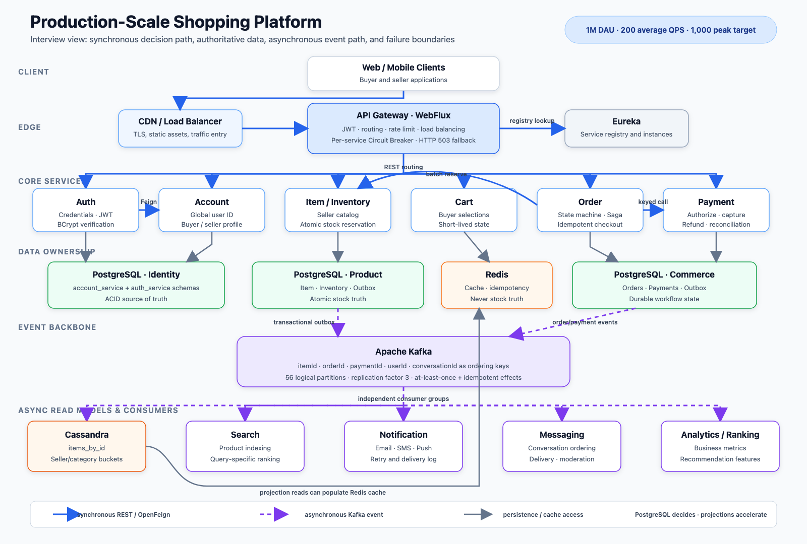

# Senior Java Interview Q&A V2 — Production-Scale Shopping Platform

This version is written in conversational English. Each major answer follows the same path: define the idea, explain how it works, connect it to the shopping platform, quantify the effect, and explain failure handling.

## How to use this document

Learn the first two paragraphs of each “What I say” section. Use the detailed sections only when the interviewer follows up. Do not memorize numbers without understanding their calculation.

The capacity model used consistently throughout the document is one million daily active users, 200 average API QPS, a five-times peak target of 1,000 QPS, 80,000 orders per day, 50 peak orders per second, and four lines per normal order. These are capacity-planning inputs. Describe them as measured production facts only when you have real dashboards or load-test evidence that you can defend.

## Page index

1. Project introduction
2. Main data flows
3. Spring, Spring Boot, and Spring Cloud
4. IoC, dependency injection, and bean lifecycle
5. AOP and Spring proxies
6. REST, OpenFeign, gRPC, and discovery
7. WebFlux Gateway, load balancing, and Circuit Breaker
8. JWT, Auth, Account, and global identity
9. PostgreSQL tables, indexes, and query tuning
10. Local transactions, isolation, and inventory concurrency
11. Transactional outbox
12. Kafka topics, partitions, keys, consumers, and reliability
13. Cassandra partitions, buckets, consistency, and failure
14. Redis caching, idempotency, DAU, and failure
15. Java multithreading, thread pools, queues, Fork/Join, and futures
16. Concurrent order processing
17. Distributed Saga and compensation
18. Fault-tolerance patterns
19. Performance tuning and defensible numbers
20. Monitoring, logging, tracing, and alerting
21. Eureka, Docker, Kubernetes, and deployment
22. Testing and failure injection
23. Design patterns used in the shopping platform
24. Rapid deep-dive questions
25. Final answers and number sheet

---

# Page 1 — Tell Me About Your Project

## What the interviewer may ask

“Can you introduce your project?” “What problem does it solve?” “What did you build?”

## What I say

I worked on a Java and Spring Boot online-shopping platform for buyers and sellers. Buyers can register, log in, browse products, manage a cart, place orders, pay, view order history, and receive notifications. Sellers manage their own stores, publish products, update price and stock, and process orders. The production architecture has API Gateway, Auth, Account, Item, Inventory, Cart, Order, Payment, Search, Notification, Messaging, and Recommendation boundaries.

The system is designed around one million daily active users, approximately 200 API requests per second on average, and a 1,000-QPS peak target. PostgreSQL is the source of truth for accounts, item writes, inventory, orders, payments, and outbox records. Cassandra stores query-oriented item projections, Redis caches hot item and order data, and Kafka distributes committed business events to projections and downstream services.

The most important rule is that a fast read store never makes a transactional decision. Redis and Cassandra make browsing fast, but checkout always uses PostgreSQL inventory and an atomic conditional update. This lets the read path scale without risking overselling.

## High-level architecture



The solid blue arrows show synchronous calls that must return an immediate answer. Dashed purple arrows show Kafka events that can be processed after the business transaction commits. Gray arrows show persistence and cache access. The green PostgreSQL boxes are authoritative; Cassandra and Redis accelerate reads but never approve stock or payment.

### Text fallback

```text
Web / Mobile Client
        │
        ▼
CDN / External Load Balancer
        │
        ▼
API Gateway — WebFlux, JWT, routing, circuit breakers, rate limits
        │
        ├──────── synchronous REST / OpenFeign ─────────────┐
        ▼                                                   ▼
Auth ──► Account       Item / Inventory       Cart ──────► Order
                         │    │                              │
                         │    └── PostgreSQL stock          ▼
                         ▼                               Payment
               PostgreSQL item truth                         │
                         │                                   │
                         └──── transactional outbox ──────────┘
                                             │
                                             ▼
                                           Kafka
                    ┌────────────────────────┼──────────────────────┐
                    ▼                        ▼                      ▼
           Cassandra projections          Search              Notification
                    │                                               │
                    ▼                                               ▼
                 Redis cache                                  Email/SMS/Push

Other consumers: Messaging, Recommendation, Analytics, Reconciliation
```

The diagram separates work that must finish before the response from work that can finish later. Login and stock reservation need immediate results, so they use HTTP. Cassandra projection, search indexing, notification, and analytics use Kafka so they do not extend user-facing latency.

## Numbers I can explain

```text
200 QPS × 86,400 seconds/day = 17,280,000 API requests/day
17,280,000 / 1,000,000 DAU = 17.28 requests per active user/day
200 average QPS × 5 peak factor = 1,000 peak QPS
```

The peak traffic model is approximately 700 QPS for catalog/search, 100 for authentication/account, 100 for cart, 50 for order/payment, and 50 for other APIs. This matters because Item is read-heavy while Order and Payment are correctness-heavy.

## Deep questions

### Why microservices instead of one application?

The useful boundary is independent ownership of a business capability and its data. Item has a large read workload, Order has state transitions, Payment has stricter audit requirements, and Notification can be asynchronous. Separate services let these workloads scale, deploy, and fail independently.

The cost is distributed-system complexity: HTTP can time out after a commit, Kafka can redeliver, and two services cannot share a normal local transaction. I accept that cost only where the boundary creates real scaling, reliability, security, or team-ownership value.

### How do you avoid a distributed monolith?

I avoid shared-table access, long synchronous call chains, and coordinated releases. Each service owns its schema, secondary work uses events, and contracts stay backward compatible. If every request requires five services and every deployment requires all teams, the system is microservices only by name.

### What are the main non-functional requirements?

The model targets 1,000 peak QPS, no overselling, no duplicate charge, durable asynchronous work, and bounded catalog staleness. Example SLOs are cached item-read p99 below 50 ms, order-acceptance p99 below 500 ms, and item-projection lag p99 below five seconds. A number becomes a result only after a reproducible test verifies it.

---

# Page 2 — Main Data Flows

## What I say

I explain registration, item creation, and checkout because together they demonstrate identity, local transactions, cache, Kafka, concurrency, and recovery.

## Registration and login

```text
Client → Gateway → Auth Service → Account Service → account_service.accounts
                         │              │
                         │              └── returns canonical userId
                         ▼
                 auth_service.users
             same userId + BCrypt hash + role
                         │
                         └── signed JWT to browser
```

Account owns profile identity and generates the global user ID. Auth owns credentials. Auth stores the Account ID as its own user primary key, so Item can use it for seller ownership and Order can use it for buyer ownership. Login loads only Auth data, verifies the BCrypt hash, and creates a JWT; it does not need an Account call.

## Seller creates an item

```text
SELLER JWT → Gateway → Item Service
                            │
                            ▼
                 one PostgreSQL transaction
                 ├── INSERT item
                 ├── INSERT inventory
                 └── INSERT outbox PENDING
                            │ commit
                            ▼
                Outbox Publisher → Kafka, key=itemId
                                      │
                                      ▼
                              Projection Consumer
                              ├── Cassandra upsert
                              └── Redis invalidation
```

Item, initial stock, and the publication intent commit together. If Kafka is down, PostgreSQL still contains the truth and the outbox row remains pending for retry. The read projection becomes temporarily stale, but the event is not lost.

## Buyer places an order

```text
Client sends Idempotency-Key
  ▼
Gateway → Order Service → persist PENDING order/command
                              │
                              ▼
                     durable Kafka worker
                     ├── batch stock reservation
                     ├── idempotent payment authorization
                     ├── order state transition
                     └── outbox event
                              │
                              ├── Notification
                              ├── Analytics
                              └── Seller fulfillment
```

The request thread is not the durable queue. If processing continues asynchronously, I persist a command first and let a Kafka-backed worker handle it. A plain `@Async` task exists only in JVM memory and can disappear during restart.

## Deep questions

### Why not call every downstream service synchronously?

Each mandatory dependency adds latency and availability risk. Four independently 99.9%-available dependencies required in one path give `0.999⁴ = 99.6006%` theoretical combined availability. Search, notification, recommendation, and analytics therefore stay outside checkout’s critical path.

### What if the client times out after the server commits?

A timeout means unknown outcome, not failure. The client retries with the same idempotency key, and the service returns the recorded result. Payment uses the same provider idempotency key instead of issuing a new charge.

---

# Page 3 — Spring, Spring Boot, and Spring Cloud

## What the interviewer may ask

“Do you know Spring?” “What are its main features?” “Why Spring Boot?”

## What I say

Spring is a Java application framework. Its foundation is the IoC container, which creates and connects application objects, and AOP, which applies reusable behavior such as transactions around selected method calls. Spring also provides MVC/WebFlux, data access, validation, security integration, caching, scheduling, messaging, and testing.

Spring Boot is the opinionated layer that supplies starters, auto-configuration, embedded servers, external configuration, Actuator, and executable services. Spring Cloud adds distributed-system tools such as Gateway, Eureka integration, OpenFeign, LoadBalancer, and Circuit Breaker.

In this platform, `@SpringBootApplication` starts each service. Spring discovers controllers, services, repositories, configurations, and components, creates them as beans, injects their dependencies, and applies transaction, cache, Feign, Kafka, and security infrastructure.

## Three layers in this project

| Layer | Plain meaning | Examples here |
|---|---|---|
| Spring Framework | Creates objects and applies infrastructure | IoC, AOP, transactions, MVC/WebFlux |
| Spring Boot | Configures and runs the application | starters, auto-configuration, Netty/Tomcat, Actuator |
| Spring Cloud | Handles distributed-service concerns | Gateway, Eureka, Feign, LoadBalancer, Circuit Breaker |

## How auto-configuration works

Boot checks the classpath, configuration properties, and existing beans. If JPA and PostgreSQL are present, it can configure a datasource, Hibernate, repositories, and transaction support. If Eureka client is present, modern Spring Cloud registers the service without requiring `@EnableEurekaClient`. Auto-configuration is conditional, not magic; the condition-evaluation report shows why a configuration matched.

## Deep questions

### What does `@SpringBootApplication` mean?

It combines application configuration, auto-configuration, and component scanning. Package placement matters because scanning begins from the application package and its children. A class elsewhere is not active merely because its source file exists.

### What is a starter?

A starter is a curated dependency group. `spring-boot-starter-data-jpa` brings the common JPA/Hibernate stack in compatible versions. Starters reduce version mismatch, but I still inspect the dependency tree when both MVC and reactive libraries may appear.

### What do `@Component`, `@Service`, and `@Repository` change?

All register components. `@Service` communicates business responsibility. `@Repository` identifies persistence code and supports persistence-exception translation. `@RestController` participates in web request mapping. The names improve architecture and can trigger specialized framework behavior.

### Does Spring itself improve QPS?

Not automatically. Its main value is consistent lifecycle, configuration, and infrastructure. It can improve performance indirectly by reusing connection factories, clients, serializers, and caches, but those effects must be measured at the actual component.

---

# Page 4 — IoC, Dependency Injection, and Bean Lifecycle

## What the interviewer may ask

“What is IoC?” “What is dependency injection?” “Is a singleton thread-safe?”

## What I say

IoC means a class does not create and locate all collaborators itself. It declares what it needs, and the Spring container creates those objects and connects them. Dependency injection is the technique used to supply those collaborators.

`OrderServiceImpl`, for example, receives `OrderRepository` and `ItemClient` through its constructor. It does not manually create a repository or discover Item Service. A unit test can therefore provide mocks without starting the full application.

```java
public OrderServiceImpl(OrderRepository repository, ItemClient itemClient) {
    this.repository = repository;
    this.itemClient = itemClient;
}
```

## Bean lifecycle in plain language

Spring reads configuration and component metadata, creates bean definitions, resolves constructor dependencies, and instantiates beans. Bean post-processors may wrap objects in transaction, cache, security, or custom AOP proxies. Initialization callbacks run, the application serves traffic, and destruction callbacks close managed resources during graceful shutdown.

The injected reference may therefore be a proxy instead of the raw class. This is why calling an annotated method through Spring can behave differently from calling `this.method()` inside the same object.

## Why constructor injection

Constructor injection makes required dependencies visible, supports final fields, prevents partially initialized objects, and makes unit tests simple. Field injection hides requirements and usually needs reflection or a Spring context during testing.

## Bean scopes and thread safety

Most controllers, services, and repositories are singleton beans: one instance per application context, not one across the whole cluster. Spring does not automatically make a singleton thread-safe. Stateless services are normally safe because request variables live on each thread’s stack. A mutable “current user” field in a singleton would be a serious concurrency bug.

## Deep questions

### What happens with a circular dependency?

Constructor cycles cannot be instantiated cleanly and usually reveal confused responsibility. I break the cycle by extracting a third component, changing the dependency direction, or publishing an event. I do not hide a design problem with lazy field injection.

### How does IoC help operations?

The container owns lifecycle and configuration of expensive shared objects such as connection pools, HTTP clients, Kafka templates, and cache managers. This prevents each request from creating a new client or connection. I describe this as resource reuse and testability, not as a guaranteed throughput number.

---

# Page 5 — AOP in Plain English

## What the interviewer may ask

“What is AOP?” “Where do you use it?” “How does `@Transactional` work?”

## What I say

AOP stands for aspect-oriented programming. It is useful when many methods need the same surrounding behavior, such as opening a transaction, checking a cache, measuring latency, or writing an audit log. Spring places a proxy in front of the object, and that proxy runs extra logic before and after the real method.

When a controller calls an Item method annotated with `@Transactional`, it normally calls the proxy. The proxy opens a database transaction, calls the real method, commits on success, and rolls back on a configured failure. The business method only expresses “save Item, Inventory, and Outbox.”

```text
Controller → Spring proxy → begin transaction → real service method
                                      │
                                      ├── save Item
                                      ├── save Inventory
                                      └── save OutboxEvent
                                      │
                      success → commit; failure → rollback
```

That is what it means when we say Spring AOP powers `@Transactional`. The annotation is metadata. A transaction interceptor around the method performs the actual work.

## Caching uses the same proxy idea

`@Cacheable` checks Redis before the method. On a cache hit, the method and database read are skipped. On a miss, the method runs and the result is stored. `@CachePut` always executes the method and then replaces the cached value. `@CacheEvict` removes data that may now be stale.

Item detail uses `@Cacheable`; create/update use `@CachePut`; writes evict global and seller item lists. Order detail is cached similarly. The ten-minute TTL provides a final bound, while write/event invalidation normally removes stale data sooner.

## Custom aspect in the repository

`Common/aop/LoggingAspect.java` defines a real `@Aspect`. Its pointcuts select controller, service, and DAO packages. `@Around` wraps calls to log entry, exit, and failure, while `@AfterThrowing` handles exceptions.

One packaging fact matters: the root Maven build does not currently list `Common` as a module and the active services do not depend on it. The aspect exists as code, but it is not automatically loaded into every running service. Before claiming centralized logging is active everywhere, it must be published/imported as a shared starter or placed in each application’s scan path.

## Vocabulary

An aspect is the reusable module. A join point is a possible method execution. A pointcut is the rule selecting methods. Advice is the code that runs before, after, around, or after an exception. In `LoggingAspect`, the package expression is the pointcut and `logAround` is around advice.

## Performance impact

AOP itself is not a performance optimization. Proxy overhead is usually tiny compared with database or network I/O. The advice determines the effect: cache advice may eliminate expensive reads, while synchronous serialization and logging of large objects can reduce throughput. I measure enabled versus disabled behavior and avoid logging passwords, JWTs, addresses, or payment data.

## Deep questions

### What is self-invocation?

If `createOrder()` calls `this.saveInNewTransaction()` in the same object, the second call bypasses the proxy. Its `@Transactional`, `@Cacheable`, or `@Async` advice may not run. I move the second boundary into another bean or put the annotation on the externally invoked method.

### JDK proxy or CGLIB?

Spring can proxy interfaces through JDK dynamic proxies or create a class-based subclass proxy. Final methods cannot be overridden by a class proxy, and private methods are not normal proxy entry points. The practical rule is to annotate externally invoked service methods and test rollback/cache behavior.

### Can transaction and cache advice conflict?

Yes. If a cache write becomes visible before the database transaction commits and the transaction rolls back, clients may see nonexistent data. I prefer after-commit invalidation or committed outbox events and test rollback paths.

### What is the one-sentence project answer?

I use AOP to keep repeated infrastructure out of business code: transaction advice makes Item, Inventory, and Outbox atomic, cache advice removes repeated reads and stale entries, and a logging aspect can apply consistent diagnostics across selected packages.

---

# Page 6 — REST, OpenFeign, gRPC, and Service Discovery

## What the interviewer may ask

“How do services communicate?” “Why Feign?” “Why not RestTemplate or gRPC?”

## What I say

I use synchronous REST when the caller needs an immediate answer and Kafka when the work can finish later. Auth calls Account during registration because it needs the global user ID. Order calls Item/Inventory because it needs an immediate stock decision. Cassandra projection, search, notification, and analytics are asynchronous.

OpenFeign represents a REST client as a Java interface. Spring creates the implementation. Eureka supplies addresses for the logical service name, and Spring Cloud LoadBalancer selects an instance. Feign reduces repetitive request construction, but I still configure timeouts, circuit breakers, tracing, error mapping, and safe retry rules.

```java
@FeignClient(name = "ITEM-SERVICE")
interface ItemClient {
    @GetMapping("/api/items/{id}")
    ItemDTO getItem(@PathVariable String id);
}
```

## Communication map

```text
Auth ── OpenFeign ──► ACCOUNT-SERVICE
Order ── OpenFeign ──► ITEM-SERVICE
Gateway ── reactive HTTP + LoadBalancer ──► all exposed services
Item ── Kafka ──► Cassandra projection/cache invalidation
```

`RestTemplate` is imperative: the current thread waits and the caller manually builds requests. It remains understandable for legacy synchronous code, but Feign is cleaner for stable internal contracts. `WebClient` is reactive and is a better fit for WebFlux. Calling `.block()` on a Gateway event-loop thread defeats its non-blocking model.

gRPC uses Protobuf and HTTP/2. It is useful for controlled internal contracts, streaming, or very high call frequency. It does not solve chattiness. Replacing sixteen REST calls with sixteen gRPC calls is usually less valuable than creating one batch endpoint.

## Numeric improvement from batching

The current checkout makes `N` item-detail calls and `N` inventory-reservation calls, or `2N` Item Service calls in total. The detail calls are launched concurrently through a dedicated executor, while reservations are deliberately performed in sequence. An eight-line order therefore still produces 16 network calls. One batch read and one batch reservation reduce 16 calls to two, an 87.5% reduction. A combined validated reservation endpoint reduces it to one, a 93.75% reduction. These are exact round-trip reductions, not invented latency measurements.

## Fault tolerance

GET can sometimes be retried because it is idempotent. Reservation and payment must carry stable idempotency keys before retry. Retries use a small attempt limit, exponential backoff, jitter, and the caller’s remaining deadline. A circuit breaker stops requests when recent evidence says a dependency is unhealthy.

## Deep questions

### What happens when a Feign client has a name but no URL?

The name is a logical destination. LoadBalancer obtains instances from discovery and chooses one. If a fixed URL is configured, discovery-based load balancing is bypassed.

### How deep should a synchronous chain be?

Keep it short. `Gateway → Order → Inventory/Payment` is already sensitive. Inventory should not synchronously call Account, Notification, Search, and Analytics. Required data should be part of the command, a local projection, or an event.

### Is Feign asynchronous?

The standard OpenFeign client used by Spring MVC services is normally blocking. Declarative means less client boilerplate, not non-blocking execution. Thread and connection-pool sizing still matters.

---

# Page 7 — API Gateway, WebFlux, Load Balancing, and Circuit Breaker

## What I say

The Gateway is the public entry point. It matches routes, validates JWTs, applies edge controls, resolves service names, load-balances traffic, and returns consistent failures. Business rules remain in the owning service; the Gateway should not become a second Order Service.

I use WebFlux Gateway because proxying is mostly network waiting. Reactor Netty can keep many connections in flight with a small event-loop model. Business services remain Spring MVC/JPA because JDBC and JPA are blocking. A reactive Gateway does not require reactive databases downstream.

## Request path

```text
request → route predicate → JWT filter → per-service circuit breaker
        → LoadBalancer → selected service instance → response
                                             └─ failure → local 503 fallback
```

The project has separate breakers for Account, Item, Auth, and Order. One unhealthy service therefore does not disable unrelated routes.

## Current breaker configuration

The count-based window stores ten calls and waits for at least five calls before calculating failure rate. Failure rate or slow-call rate of 50% opens the breaker. Calls over two seconds are slow; the time limit is three seconds. The breaker waits ten seconds, then allows three half-open probe calls. HTTP `500`, `502`, `503`, and `504` count as failures, while a normal client validation `400` does not.

After five calls, three failures equal 60%, so the breaker opens. While open, new calls return the local HTTP 503 JSON without touching the failed service. After ten seconds, probe calls decide whether to close or reopen it.

## Why this protects performance

Circuit breaking does not accelerate healthy requests. It limits damage during failure. At 1,000 requests/s and a three-second timeout, approximately 3,000 calls can be in flight. After the breaker opens, calls fail locally in milliseconds, protecting memory, connections, event-loop capacity, and downstream recovery.

## Deep questions

### Circuit breaker, timeout, retry, bulkhead, or rate limiter?

A timeout limits one call’s duration. A retry makes another attempt. A circuit breaker stops attempts based on recent failures. A bulkhead limits concurrent resource consumption. A rate limiter controls admitted request rate. They solve different problems and should not be described as interchangeable.

### Why not return HTTP 200 from fallback?

That would turn infrastructure failure into false business success. The fallback returns 503. Stale catalog data can be served only when explicitly safe; cached inventory must never approve checkout.

### Why not change every service to WebFlux?

The services use JPA/JDBC, which still block. Wrapping a blocking repository result in `Mono` does not make the query non-blocking. MVC is a clear fit for transaction-heavy services; WebFlux earns its complexity at the network-heavy Gateway.

### How do you monitor a breaker?

I monitor state transitions, rejected calls, fallback rate, failure rate, and slow-call rate by route. Repeated open/half-open flapping indicates unstable dependencies, unrealistic thresholds, or insufficient recovery time.

---

# Page 8 — JWT, Auth, Account, and Global User ID

## What I say

Authentication answers who the caller is; authorization answers what the caller may do. Auth owns email, BCrypt password hash, and token issuance. Account owns the profile and creates the canonical user ID. Item and Order use that stable ID for ownership.

During registration, Auth normalizes email and calls Account. Account returns its generated ID, and Auth stores the credential using that same primary key. Login verifies the hash locally and issues a signed JWT containing `sub=userId`, email, role, issuer, audience, timestamps, and token ID.

A JWT is signed, not encrypted by default. Clients can read claims, so it must not contain passwords, addresses, secrets, or payment data. UI routing can use the role, but Item Service still enforces seller ownership.

## Performance effect

Gateway validation is local cryptographic work. At 1,000 peak QPS, calling Auth or Redis for every request would add up to 1,000 network lookups/s. Local JWT verification removes that hop. The cost is revocation complexity, so production normally uses shorter access tokens, refresh rotation, key rotation, and issuer/audience enforcement.

## Failure handling

Registration spans Account and Auth, so one normal `@Transactional` cannot cover both. If Account commits and Auth fails, an orphan may remain. A robust flow uses an idempotency key and registration state machine; a retry finds the pending account instead of creating a duplicate.

If Auth is down, existing valid tokens can still be verified locally, so most authenticated traffic continues. New login, registration, and refresh are unavailable.

## Deep questions

### Why hash rather than encrypt passwords?

The service only needs to verify a guess, not recover the original. BCrypt is salted and intentionally expensive. Reversible encryption creates a decryption-key risk.

### Why authorize again inside Item Service?

Gateway is the edge boundary; Item owns “a seller may modify only their own product.” Service-side enforcement protects against route mistakes, internal misuse, and future alternate entry paths.

### What should `sub` contain?

The stable canonical identity, not a mutable email. Email can change; ownership and audit records should not.

---

# Page 9 — PostgreSQL Tables, Indexes, and Query Tuning

## What I say

PostgreSQL is the source of truth for data needing ACID transactions, constraints, and concurrency control. Accounts need unique email, inventory cannot become negative, orders need durable state and historical line snapshots, and payment needs idempotency and auditability.

Local development uses one PostgreSQL instance with separate schemas. Ownership still belongs to each service, and production credentials should prevent one service from directly reading another schema.

## Core tables

| Schema | Table | Key design |
|---|---|---|
| `account_service` | `accounts` | generated ID, unique email, seller flag, profile |
| `auth_service` | `users` | shared global ID, unique email, BCrypt hash, role |
| `inventory_service` | `items` | UUID ID, immutable seller ID, money, timestamps, `@Version` |
| `inventory_service` | `inventory` | item ID PK, available quantity, version |
| `inventory_service` | `outbox_events` | event/aggregate IDs, version, JSONB, status, attempts |
| `order_service` | `orders` | buyer ID, total, currency, status, idempotency key |
| `order_service` | `order_items` | order FK, item/name/price snapshot, quantity |

Order lines copy name and price because yesterday’s receipt must not change when today’s catalog changes.

## Useful indexes

```sql
CREATE INDEX idx_items_seller_created
ON items (user_id, created_at DESC, id);

CREATE INDEX idx_orders_user_created
ON orders (user_id, created_at DESC, id);

CREATE INDEX idx_outbox_pending_created
ON outbox_events (created_at) WHERE status = 'PENDING';

CREATE UNIQUE INDEX uk_orders_user_idempotency
ON orders (user_id, idempotency_key);
```

Indexes accelerate matching reads but consume disk, cache, WAL, vacuum work, and write I/O. The seller and order indexes match filtering plus ordering. The partial outbox index excludes old published rows. The unique idempotency index is the final duplicate guard if Redis loses data.

## Keyset pagination

```sql
SELECT id, total_price, status, created_at
FROM orders
WHERE user_id = :userId
  AND (created_at, id) < (:lastCreatedAt, :lastId)
ORDER BY created_at DESC, id DESC
LIMIT 50;
```

With a matching index, a deep page seeks near its cursor. Offset page 10,000 at 50 rows/page may discard about 500,000 rows before returning 50.

## Capacity example

Eighty thousand daily orders create 29.2 million headers/year. Four lines each create 116.8 million lines/year. At assumed row payloads of 500 and 300 bytes, logical data is roughly 14.6 GB and 35 GB before indexes, tuple overhead, WAL, bloat, replicas, backups, and headroom.

## Deep questions

### How do you prove an index helps?

I compare `EXPLAIN (ANALYZE, BUFFERS)` on production-shaped data. I inspect actual rows, scan type, sort, loops, heap fetches, buffer hits/reads, and duration. I also test write throughput because read indexes are not free.

### What is the N+1 problem here?

A 100-item page can perform one item query plus 100 inventory lookups. One batch `WHERE item_id IN (...)` changes 100 inventory round trips into one, a 99% reduction. Eager order lines may similarly over-fetch history pages.

### Why not `ddl-auto=update` in production?

It is convenient locally but is not a reviewed, versioned migration plan. Flyway/Liquibase and expand-migrate-contract allow old and new service versions to coexist during rolling deployments.

---

# Page 10 — Local Transactions, Isolation, and Inventory Concurrency

## What I say

A local transaction groups database changes managed by one transaction manager so they either commit together or roll back together. I use it when a business operation would be invalid if only half of its rows were saved. In Item Service, creating a product must not leave an Item without Inventory, and a committed item change must not lose the Outbox record that will update Kafka and Cassandra. Those rows therefore belong to one PostgreSQL transaction.

Spring applies `@Transactional` through a proxy. The proxy opens the transaction, invokes the method, commits on success, and normally rolls back on an unchecked exception. I keep the annotation on externally invoked service methods rather than controllers or private helper methods, because the service method represents the business boundary and must be entered through the Spring proxy.

## Where I use transactions in this project

| Location | What commits together | Why I need the transaction |
|---|---|---|
| `ItemServiceImpl.createItem()` | Item, initial Inventory, and `ITEM_CREATED` Outbox row | A product must not exist without stock state, and a committed product must eventually reach Kafka/Cassandra. |
| `ItemServiceImpl.updateItem()` | Item changes, Inventory changes, and `ITEM_UPDATED` Outbox row | Price, stock, and the event describing them must represent the same committed version. |
| `ItemServiceImpl.deleteItem()` | Outbox deletion event plus Item and Inventory deletion | Consumers must be told about every committed deletion; a failed transaction restores all three database changes. |
| `increaseStock()` / `decreaseStock()` | Atomic inventory update and `INVENTORY_CHANGED` Outbox row | Redis/Cassandra invalidation must eventually follow the exact stock version that PostgreSQL accepted. |
| `OutboxService.enqueue()` with `MANDATORY` | Joins the caller’s Item transaction | It fails immediately if a developer tries to write an outbox row without an existing business transaction. |
| `OutboxService.markPublished()` / `markFailed()` with `REQUIRES_NEW` | One publisher-status update | Kafka acknowledgement happens after the original business transaction, so publisher progress needs its own short transaction. |
| `OrderPersistenceService.save()` | Order header and cascaded OrderItem snapshots | An order must not be stored with only some of its lines. The separate bean also ensures the call enters a Spring transaction proxy. |
| `AuthServiceImpl.register()` | The local Auth credential row | It protects the Auth database write, but it cannot roll back the earlier Account Service HTTP call. Registration therefore also needs idempotency and reconciliation across services. |

The transaction is not used merely because a method writes data. I use it when multiple changes form one invariant. Read-only lookups can use `readOnly=true` to communicate intent and allow provider optimizations, while a single repository operation already runs within repository transaction semantics.

## What the transaction does not include

An Order Service transaction cannot include `itemClient.reserve()` because that is an HTTP call into a different process and transaction manager. Likewise, the Item PostgreSQL transaction does not directly include Redis, Cassandra, or Kafka. Holding the Order database transaction open around Feign would consume a database connection while waiting on the network and still would not make the two commits atomic.

I solve those boundaries with different patterns. PostgreSQL plus Outbox handles database-to-Kafka reliability. An order workflow uses durable state, an idempotent `reservationId`, and Saga compensation for Order, Inventory, and Payment. Redis and Cassandra remain rebuildable read paths rather than participants in the business transaction.

## Isolation in plain language

PostgreSQL defaults to Read Committed: each statement sees committed data as of that statement. Repeatable Read holds one stable snapshot. Serializable prevents serialization anomalies but may abort transactions that the application must retry. I choose isolation by invariant rather than globally selecting the strongest setting.

## Preventing overselling

```sql
UPDATE inventory
SET available_quantity = available_quantity - :quantity,
    version = version + 1
WHERE item_id = :itemId
  AND available_quantity >= :quantity;
```

One affected row means success; zero means conflict or missing inventory. Condition and decrement are one atomic database statement. Two service replicas cannot both spend the same last unit.

With stock 100 and 1,000 concurrent one-unit requests, the integration test must produce exactly 100 successes, 900 conflicts, and final quantity zero. The test must use real PostgreSQL and multiple instances to prove database behavior.

This also removes an unsafe read-then-write decision. A separate `SELECT quantity` followed by `UPDATE quantity` uses two database statements and allows both buyers to read the same old value unless locking or version checks are added. The conditional update makes the decision and mutation in one statement. Its main benefit is correctness; the reduction from two stock-decision statements to one is a secondary performance benefit.

## Optimistic and pessimistic locking

Item metadata uses JPA `@Version`. Two editors reading version 5 cannot both overwrite version 6; one receives an optimistic-lock failure. Pessimistic `FOR UPDATE` locks before modification and makes competitors wait. It helps short multi-step sections but increases blocking and deadlock risk. The conditional update is the clearest stock operation.

## Deep questions

### Does a transaction propagate to an `@Async` thread?

No. Imperative Spring transaction context is thread-bound. The worker may start its own transaction through another proxied bean, but it does not inherit the request thread’s transaction.

### Why is order persistence in a separate service bean?

`OrderServiceImpl` performs remote orchestration, while `OrderPersistenceService.save()` defines a short PostgreSQL boundary for the order header and lines. Calling another Spring bean passes through the transaction proxy. Putting `@Transactional` on a private helper or calling an annotated method through `this` would bypass normal proxy interception.

### Does rollback undo a successful Feign inventory call?

No. If Item Service has committed its local inventory transaction, rolling back Order Service changes only the Order database. That is why inventory reservation needs a stable `reservationId`, idempotent confirm/release operations, durable Saga state, and reconciliation for a process crash or unknown HTTP outcome.

### What if a deadlock happens?

PostgreSQL detects the cycle and aborts a participant. I use consistent lock ordering, short transactions, deadlock logs, and bounded retries for idempotent work. A larger timeout does not fix inconsistent lock order.

### What if the process crashes after commit?

Committed data survives. The outbox row in that same transaction allows another publisher to deliver the event later. That connects local ACID correctness to distributed recovery.

---

# Page 11 — Transactional Outbox

## What the interviewer may ask

“How do you keep PostgreSQL and Kafka consistent?” “What does the outbox service do?”

## What I say

The outbox pattern solves the database-and-message dual-write problem. Without it, Item Service could commit PostgreSQL and fail before sending Kafka, or send Kafka and then roll back PostgreSQL. Either order can create inconsistency.

Instead, the business row and an outbox row commit in one local PostgreSQL transaction. The outbox row is a durable statement that an event must be published. A separate publisher reads pending rows, sends them to Kafka, and marks them published after broker acknowledgement.

```text
createItem transaction
  ├── items INSERT
  ├── inventory INSERT
  └── outbox_events INSERT, status=PENDING
             │
             └── one commit

scheduled publisher
  ├── read oldest 50 PENDING
  ├── send to Kafka with key=itemId
  ├── acknowledgement received
  └── mark PUBLISHED in a new transaction
```

`OutboxService` owns database state. `enqueue()` uses `MANDATORY`, which means it must join an existing transaction; calling it without one fails. `markPublished()` and `markFailed()` use `REQUIRES_NEW`, so publisher status is committed independently from the old business transaction.

`OutboxPublisher` owns polling and retry behavior. `EventProducer` owns Kafka transport and serialization. Keeping them separate gives clear transaction boundaries and focused tests.

## Why `CompletableFuture` appears in the producer

`KafkaTemplate.send()` returns immediately with a `CompletableFuture` because the broker acknowledgement arrives later. The future eventually contains the result or error. The current publisher waits at most ten seconds because it must know whether it is safe to mark the row published.

The future does not automatically mean parallel processing. The current loop calls `.get()` for each row, so sends are effectively confirmed one at a time. A scaled publisher can keep a bounded number of sends in flight, but must preserve per-aggregate order and avoid unbounded memory.

## Throughput math

The batch size is 50 and the fixed delay is one second after a run finishes. If each acknowledgement takes 20 ms and sends are sequential, 50 sends take roughly one second, followed by the one-second delay: about 25 events/s. If acknowledgements are near zero, the static ceiling remains below 50 events/s because of the delay. Actual throughput requires measurement.

## Failure handling

If Kafka is down, the row stays pending, attempt count increases, and the oldest-pending age alert rises. If Kafka acknowledges and the process crashes before `PUBLISHED`, the row is sent again. Therefore delivery is at least once and consumers must be idempotent.

At higher scale, multiple publishers claim rows with `FOR UPDATE SKIP LOCKED`, bounded batches, and retry scheduling. Published rows are archived or partitioned so the polling index stays small. CDC such as Debezium is another relay option.

## Deep questions

### Why not wrap PostgreSQL and Kafka in one `@Transactional`?

A normal JPA transaction manager controls PostgreSQL, not a distributed atomic commit with Kafka. Even when Kafka transactions are enabled, coordinating an external database still has failure windows. The outbox turns the required message into database state that can be retried.

### Why does producer idempotence not solve everything?

Kafka producer idempotence protects retries within a producer session and partition. It does not atomically mark the PostgreSQL outbox row. A crash between those systems can still create duplicate events, so consumers need event ID or aggregate-version deduplication.

### How do you keep events for one item ordered with multiple publishers?

Kafka uses `itemId` as the key, putting an item’s events in one partition. Publishers must claim rows in aggregate-version order or prevent concurrent publishing for the same aggregate. Consumers also reject an event whose aggregate version is not newer.

---

# Page 12 — Kafka: Topics, Partitions, Keys, Consumers, and Reliability

## What the interviewer may ask

“Do you know Kafka?” “How many topics and partitions?” “What if Kafka is down?”

## What I say

Kafka is a durable distributed event log. A topic is a named stream, a partition is an ordered shard of that stream, and a key determines which partition receives an event. Consumer groups let multiple instances divide partitions, while different groups independently receive the same events.

I use Kafka to remove secondary work from user-facing requests. Item Service commits PostgreSQL and outbox first. Cassandra, Search, cache invalidation, and Analytics consume the event independently. This reduces synchronous coupling and lets a slow consumer catch up from retained records.

## Topic model

| Topic | Peak rate | Partitions | Key | Example consumer groups | Retention |
|---|---:|---:|---|---|---:|
| `item.events.v1` | 500/s | 8 | `itemId` | Cassandra, Search, cache | 7 days |
| `order.events.v1` | 200/s | 4 | `orderId` | Payment, Notification, Analytics | 30 days |
| `payment.events.v1` | 100/s | 4 | `paymentId` | Order, Ledger, Notification | 90 days |
| `notification.commands.v1` | 500/s | 8 | `userId` | Email, SMS, Push | 3 days |
| `message.events.v1` | 2,000/s burst | 32 | `conversationId` | Delivery, Moderation, Archive | 7 days |

That is 56 logical partitions. With replication factor 3, the cluster maintains 168 partition replicas. The local Compose environment uses one broker and replication factor 1, which validates functionality but not broker failover.

## Why these keys

Kafka guarantees order inside one partition, not across the whole topic. `itemId` preserves create/update/delete order for one item. `orderId` preserves one Saga’s transitions. `paymentId` preserves authorize/capture/refund order. `conversationId` preserves message order within a conversation.

Keys can create hotspots. One celebrity conversation is limited by one partition’s capacity because preserving its strict order prevents arbitrary spreading. If product semantics permit, it can be divided into substreams with sequence-based merge; otherwise the ordered throughput has a real physical limit.

## Partition sizing

Assume one Cassandra projection consumer processes 100 events/s and item traffic peaks at 500/s:

```text
required active consumers = ceil(500 / 100) = 5
configured partitions = 8
headroom = (8 - 5) / 5 = 60%
```

Eight partitions allow at most eight simultaneously active consumers in one traditional group. A ninth instance in that group is idle. I select partition count from byte rate, processing rate, ordering, replay deadline, and growth—not from an impressive round number.

## Producer reliability

`acks=all` requires acknowledgement from all current in-sync replicas, and producer idempotence prevents duplicates caused by certain producer retries. In a three-broker cluster, replication factor 3 with `min.insync.replicas=2` can tolerate one broker loss while continuing durable acknowledged writes.

This does not create global exactly once across PostgreSQL, Kafka, Cassandra, email, and payment. The correct design is at-least-once delivery with idempotent business effects.

## Consumer flow

```text
poll records → deserialize/validate → process business effect
             → commit offset only after success
             → transient failure: bounded retry/backoff
             → permanent bad record: DLQ + alert
```

Auto commit is disabled and record acknowledgement is used. If Cassandra succeeds and the consumer crashes before offset commit, Kafka delivers the record again. Item projection compares aggregate version, while financial or notification consumers also store processed event IDs or unique business keys.

## Event size and bandwidth

At a simultaneous modeled peak and 2 KB/event:

```text
500 + 200 + 100 + 500 + 2,000 = 3,300 events/s
3,300 × 2 KB = 6.6 MB/s logical ingress
RF=3 ≈ 19.8 MB/s replica writes before overhead
```

Sustaining peak all day would be about 570 GB logical/day, so retention planning uses measured average rates, compression, and peak duration rather than pretending burst traffic is constant.

## Deep questions

### What causes consumer lag?

Arrival exceeds processing, a consumer is unhealthy, rebalances pause work, a dependency slows down, a poison event repeatedly fails, or keys are skewed. If input is 500/s and processing is 400/s, lag grows by 100/s, or 360,000 records/hour.

### How do you handle a poison message?

I distinguish transient dependency failure from a permanently invalid event. Transient failures use bounded backoff and retry topics such as one minute and ten minutes. Permanent failures go to a dead-letter topic containing original topic, partition, offset, key, trace ID, and error category. A controlled replay tool fixes and reprocesses them.

### What happens during rebalance?

Partitions move between consumers and work may pause. In-flight records may be redelivered depending on offset timing. Processing must be bounded, consumers idempotent, and poll/session timeouts aligned with worst-case record processing. Cooperative assignment can reduce disruption.

### How do you evolve event schemas?

The event envelope contains event ID, event type, schema version, aggregate ID/version, timestamp, and payload. Consumers tolerate additive fields. Breaking meaning or field types requires versioning or dual-publish migration. Avro or Protobuf with a schema registry adds compatibility enforcement.

### What if Kafka is unavailable for one hour?

Business writes can continue while outbox rows accumulate, if PostgreSQL has capacity. At 500 item events/s, one hour creates 1.8 million pending events. Recovery capacity must exceed incoming rate; at 1,000 processed/s while 500/s still arrive, catch-up is 500/s and requires another hour.

---

# Page 13 — Cassandra: Query-First Modeling, Partitions, Buckets, and Failure

## What the interviewer may ask

“Why Cassandra?” “What are partition and clustering keys?” “How do you avoid a hot partition?”

## What I say

Cassandra is a distributed wide-column database designed around known query patterns. Unlike a relational model, I do not normalize first and add arbitrary queries later. I create a table for each important query, choose a partition key that distributes load, and use clustering columns to sort rows inside that partition.

The current keyspace is `item_service`, and `items_by_id` uses item ID as its primary and partition key. Each partition contains one item projection, making point reads predictable. It cannot efficiently list every seller’s items or browse a category, so those access patterns need separate denormalized tables.

## Query tables

```sql
CREATE TABLE item_service.items_by_id (
    id text PRIMARY KEY,
    userid bigint,
    name text,
    description text,
    price decimal,
    currency text,
    version bigint
);

CREATE TABLE items_by_seller_bucket (
    seller_id bigint,
    bucket smallint,
    created_at timestamp,
    item_id text,
    name text,
    price decimal,
    version bigint,
    PRIMARY KEY ((seller_id, bucket), created_at, item_id)
) WITH CLUSTERING ORDER BY (created_at DESC, item_id ASC);
```

In the second table, `(seller_id, bucket)` is the partition key. `created_at` and `item_id` are clustering columns. A query supplies one seller and bucket, then Cassandra reads rows already sorted by time.

## Bucket sizing

For an extreme seller with one million items, `hash(itemId) % 16` produces an average of 62,500 rows per bucket:

```text
1,000,000 / 16 = 62,500 rows/partition
62,500 × assumed 1 KB = about 62.5 MB/partition
```

That stays below Cassandra’s broad guidance of roughly 100,000 values and 100 MB per partition. The tradeoff is seller-wide fan-out to 16 partitions. Bucket count is chosen from row size, seller skew, query limits, and p99 measurements.

Time buckets such as category plus day are better when the query naturally requests recent data. Hash buckets spread load evenly; time buckets support time-range pruning but can create a hot current-day partition.

## Cassandra write and read path

A write is appended to the commit log for durability and placed in a memtable. Later the memtable flushes to immutable SSTables. Reads may consult memtables and several SSTables, using indexes and Bloom filters to avoid unnecessary disk reads. Compaction merges SSTables and removes obsolete data when safe.

Deletes and TTL expiration create tombstones. Too many tombstones make reads scan dead data and hurt tail latency. I control partition size, use TTL deliberately, choose compaction by workload, and monitor tombstone warnings and pending compaction.

## Consistency and replication

The local keyspace uses `SimpleStrategy` and RF=1, appropriate only for one-node development. A production regional cluster commonly uses `NetworkTopologyStrategy`, RF=3, and a consistency level selected by freshness needs. With RF=3, `LOCAL_QUORUM` needs two replicas in the local datacenter.

Catalog projection can tolerate bounded staleness, so not every read needs the strongest consistency. Inventory cannot tolerate stale purchase decisions, which is why PostgreSQL owns stock.

## Failure and rebuild

If Cassandra is down, PostgreSQL item writes and outbox publication continue, Kafka retains events, and projection lag grows. Selected reads may fall back to PostgreSQL under a strict concurrency limit. On recovery, consumers catch up. If projection data is lost, a replay or bounded PostgreSQL snapshot rebuild recreates it because Cassandra is not the source of truth.

## Deep questions

### How does Cassandra handle concurrent updates?

Normal writes use timestamps and last-write-wins reconciliation. That works for versioned projections but is inappropriate for the last stock unit. The consumer compares aggregate versions and ignores older or equal item events.

### Why not Cassandra lightweight transactions for stock?

LWT provides compare-and-set through extra coordination, which has higher latency and lower throughput than normal Cassandra writes. PostgreSQL already owns inventory and expresses the invariant with one conditional update.

### Can adding nodes fix one hot partition?

No. Replicas for that partition still handle its traffic. I must change the partition key, add buckets, cache safe reads, isolate extreme tenants, or relax ordering/query requirements.

---

# Page 14 — Redis: Cache-Aside, Idempotency, DAU, and Failure

## What the interviewer may ask

“Why Redis?” “How does your cache work?” “Can Redis guarantee idempotency?”

## What I say

Redis is an in-memory shared data store. In this platform it accelerates item and order reads, supports fast idempotency checks and rate limiting, and can estimate daily unique users. PostgreSQL remains the source of truth; Redis is allowed to be deleted and rebuilt.

Item and Order use Spring Cache with JSON values and a ten-minute TTL. A cache-aside read checks Redis first. On a miss, the method loads the database and stores the result. Writes update truth first and then update or evict affected keys.

```text
GET item
  ├── Redis hit → return cached value
  └── miss → read origin → populate Redis → return

UPDATE item
  ├── commit PostgreSQL + outbox
  └── evict item, global-list, and seller-list caches
```

## Cache performance model

At 700 peak catalog QPS and an 85% Redis hit rate:

```text
Redis hits = 700 × 0.85 = 595 QPS
origin reads = 700 × 0.15 = 105 QPS
origin-read reduction = 595 / 700 = 85%
```

If a cache hit is 1 ms and an origin read 10 ms, the simple weighted access time is `0.85×1 + 0.15×10 = 2.35 ms`, versus 10 ms origin-only. That is a model, not a measured p99.

A production two-level cache can put Caffeine in each service instance as L1 and Redis as shared L2. Caffeine avoids a network hop but each instance has its own copy, so it needs small TTLs or broadcast invalidation. For 20,000 objects at an estimated 1.5 KB each, raw L1 data is about 30 MB before cache overhead.

## Cache penetration, stampede, and avalanche

Penetration means repeated requests for nonexistent keys reach the database; validation and short negative caching help. Stampede means many callers reload one expired hot key together; single-flight/request coalescing or controlled locking helps. Avalanche means many keys expire together; TTL jitter spreads expiration.

A 600-second TTL with ±10% jitter spreads expiry between 540 and 660 seconds rather than expiring every key at the same instant.

## Redis idempotency

The client sends one key for one logical checkout:

```text
idempotency:order:{verifiedUserId}:{clientKey}
SET key PROCESSING NX EX 900
```

`NX` makes the fast claim atomic and `EX 900` prevents an abandoned processing entry from living forever. `COMPLETED:{orderId}` returns the original result. But Redis alone is not the final guarantee because keys expire, can be evicted, or can be lost during failover. PostgreSQL also has `UNIQUE(user_id,idempotency_key)`.

## DAU with HyperLogLog

```text
PFADD dau:2026-09-08 hashed-user-id
PFCOUNT dau:2026-09-08
```

Redis HyperLogLog uses up to about 12 KB per key with about 0.81% standard error. One key per day for 365 days uses about 4.38 MB of sketch payload before replication and key overhead. It is appropriate for dashboards, not billing or compliance.

## Failure handling

If Redis and L1 disappear at an 85% hit rate, origin load can rise from 105 to 700 QPS, a 6.67-times increase. The service must cap origin concurrency, use timeouts/circuit breaking, serve stale safe data where permitted, and shed load before the database collapses. Inventory validation never relies on cached quantity.

## Deep questions

### How do you prevent stale cache overwrite?

Every projected item carries aggregate version. An event or refresh replaces a value only if its version is newer. TTL is the final bound; versioning is the ordering guard.

### How do you safely release a Redis lock?

Store a random owner token and use a Lua script to compare the value before delete. A delayed old worker must not delete a newer worker’s lock.

### Does Redis provide exactly-once checkout?

No. It reduces duplicate work. Durable business idempotency comes from the PostgreSQL unique key, stored response/state, and idempotent downstream reservation and payment commands.

---

# Page 15 — Java Multithreading, Thread Pools, Queues, Fork/Join, and Futures

## What the interviewer may ask

“Do you know multithreading?” “How does a thread pool work?” “What is ForkJoinPool?”

## What I say

Multithreading means multiple execution threads make progress inside one process. Concurrency is managing overlapping work; parallelism is actually executing work at the same moment on different cores. In a web service, Tomcat already processes many requests concurrently, so I do not create a new thread for every order.

A thread pool reuses a controlled number of worker threads. It reduces thread-creation cost and, more importantly, limits concurrency sent to PostgreSQL, Redis, payment, and other services. An unbounded pool can turn a traffic spike into memory growth, context switching, connection-pool exhaustion, and downstream collapse.

## Where I use multithreading in this project

Order Service uses a named `orderItemLookupExecutor` for independent item-detail HTTP reads during checkout. It is configured with 8 core threads, 32 maximum threads, a bounded queue of 200 tasks, a 60-second keep-alive, and `CallerRunsPolicy`. `OrderItemLookupService` submits one `CompletableFuture` per requested item to this executor and waits for all detail responses before validating currency and starting inventory reservation.

I parallelize this stage because the detail lookups are independent and read-only. For an eight-line order, sequential detail latency is approximately the sum of eight calls, while bounded parallel lookup is closer to the slowest call plus scheduling overhead. It still makes eight network calls, so the production optimization is a batch endpoint; threading improves overlap but does not remove work.

I do not send state-changing inventory reservations to the common ForkJoin pool. The current reservations remain sequential, and the production design replaces them with one idempotent batch reservation. This avoids eight concurrent partial commits and gives Inventory one local transaction in which it can validate all lines and return an all-or-none result.

## How `ThreadPoolExecutor` accepts a task

```text
submit task
  ├── workers < corePoolSize → create worker
  ├── otherwise → enqueue in work queue
  ├── queue full and workers < maximumPoolSize → create extra worker
  └── queue full and workers at max → rejection policy
```

This order surprises people: with an unbounded queue, the pool normally never grows beyond core size because tasks always queue. Therefore core size, maximum size, queue choice, and rejection policy must be designed together.

## BlockingQueue

A `BlockingQueue` coordinates producers and worker consumers. `put` can wait when a bounded queue is full; `take` can wait when it is empty. `ArrayBlockingQueue` is bounded and predictable. An unbounded `LinkedBlockingQueue` can hide overload until memory and latency become dangerous. `SynchronousQueue` stores no task; a producer must hand work directly to a worker.

For business jobs, I prefer a small bounded in-memory queue because Kafka or PostgreSQL is the durable backlog. Rejected tasks must remain pending or be negatively acknowledged; `DiscardPolicy` is unacceptable for orders.

## ForkJoinPool and `parallelStream`

ForkJoinPool is optimized for recursive CPU work. Each worker has a deque, splits work, and steals tasks from other workers when idle. It is useful for divide-and-conquer computation, not for uncontrolled blocking HTTP calls.

`parallelStream()` normally uses the shared common pool. If order code blocks that pool on payment or inventory, unrelated library work can suffer and concurrency cannot be tuned per dependency. I therefore use an explicitly named, bounded executor for item-detail lookups and avoid `parallelStream()` in the checkout path.

## CompletableFuture

A `CompletableFuture` represents a value that will arrive later and allows dependent stages. Async methods without an explicit executor commonly use the ForkJoin common pool, so production code supplies a named executor when isolation matters.

In Item Service, Kafka send returns a future because broker acknowledgement is asynchronous. The outbox publisher waits with a ten-second upper bound before marking the row published. Returning a future preserves the ability to compose or bound acknowledgement handling.

## Pool sizing with numbers

Little’s Law gives a useful starting point. At 50 peak orders/s and 400 ms average workflow time:

```text
required concurrent work = arrival rate × time
                         = 50 × 0.4
                         = 20 orders
```

Three instances with eight workers each provide 24 concurrent slots. At 400 ms average, the simple modeled capacity is `24 / 0.4 = 60 orders/s`, or 20% above the 50/s target. Real sizing uses p95/p99 time, DB connection wait, HTTP pool limits, CPU, and error rate.

For CPU-bound work, start near available cores. For blocking I/O, a starting estimate is `cores × (1 + wait/compute)`. On eight cores with 40 ms waiting and 10 ms computation, that formula gives 40 threads, but downstream pools may require a much lower limit.

## Deep questions

### Why not `@Async @Transactional createOrder()`?

The worker can open its own transaction, but the task exists only in JVM memory and disappears on restart. The transaction cannot include remote inventory and payment anyway. I persist the command first, then process it from Kafka or a claimable database job.

### What rejection policy do you use?

The current item-lookup executor uses `CallerRunsPolicy`. When its queue and maximum threads are full, the submitting request thread performs the lookup instead of silently losing it. That slows the overloaded caller and creates local backpressure, although HTTP deadlines and downstream connection limits are still required. For a durable Kafka order worker, rejection should leave the record or job uncommitted so it can retry later. Silent discard is never used for order or financial work.

### How do you detect pool saturation?

I monitor active threads, pool size, queue depth, queue wait time, task duration, rejection count, and downstream connection wait. Low CPU with a full queue often means threads are blocked on a dependency.

---

# Page 16 — Order Processing, Worker Pools, and Idempotency

## What the interviewer may ask

“Where would you use your thread pool?” “How do many users place orders safely?”

## What I say

Many HTTP requests are already concurrent, but I do not want a request thread to own a long distributed checkout. I accept the command under an idempotency key, persist a `PENDING` order and outbox record in a short transaction, and then let a bounded Kafka consumer pool process different orders concurrently.

One worker owns one order workflow. The current synchronous implementation uses a dedicated executor only to overlap independent item-detail reads; it keeps state-changing reservations sequential. The production workflow sends one batch inventory command, initiates payment using stable idempotency keys, and writes short order-state transactions. I parallelize different orders and safe reads, not separate inventory commits inside one order, because line-level write parallelism creates partial reservations and much harder compensation.

## Worker flow

```text
1. Authenticate user and validate Idempotency-Key.
2. PostgreSQL transaction inserts PENDING order + unique key + outbox.
3. Return 202 Accepted with orderId and status URL.
4. Kafka partitions the command by orderId.
5. Bounded listener concurrency processes different orders.
6. Batch reserve all lines under reservationId.
7. Authorize payment under paymentId/idempotency key.
8. Mark CONFIRMED and write outbox in a short transaction.
9. Persist compensating commands when a later step fails.
```

Kafka is the durable queue. A local executor may be used for a controlled sub-step, but its queue is small. If the instance dies, uncommitted Kafka records are reassigned and processed again, so every handler must be idempotent.

## Why not parallelize order lines?

If all eight inventory writes were parallelized, 50 orders arriving in the same second could launch as many as 400 reservation calls in a burst before retries. Some could succeed while another fails, forcing up to eight independent compensations. The current code avoids that write burst by reserving sequentially, but it still makes eight remote calls and can still partially succeed. A single batch reservation reduces network calls and gives Inventory one local transaction in which to implement a deterministic all-or-none response.

## Idempotency state

```text
missing     → one caller claims PROCESSING
PROCESSING  → return 202/status; do not start a second workflow
COMPLETED   → return the original order result
FAILED_RETRYABLE → retry the same workflow/key
FAILED_FINAL     → return the stored failure
```

Redis is a fast gate, while `UNIQUE(user_id,idempotency_key)` is the durable guard. Reservation uses `reservationId`, and Payment uses `paymentId` or the provider idempotency key. A redelivered command returns the existing outcome rather than repeating the effect.

## Deep questions

### Why return `202 Accepted`?

It means the command is durable but not final. The client receives `orderId` and polls status or receives a push/WebSocket update. If the product requires immediate confirmation, the endpoint may stay synchronous, but total deadline and unknown-result behavior must be explicit.

### What if the order worker dies after reserving stock?

The order remains in a durable state such as `STOCK_RESERVED`. Redelivery uses the same reservation ID, so reservation is not duplicated. The workflow resumes payment or eventually emits a persisted release command.

### How does the DB pool constrain the worker pool?

Forty Java workers with ten Hikari connections still allow roughly ten simultaneous DB operations. A worker should not hold a DB connection while waiting on payment. Executor, HTTP connection pool, DB pool, and downstream capacity are tuned together.

---

# Page 17 — Distributed Transactions, Saga, and Compensation

## What the interviewer may ask

“How do you handle distributed transactions?” “What if payment times out?”

## What I say

A local transaction protects one database. Checkout crosses Order, Inventory, Payment, and Notification, so I use a Saga: a sequence of durable local transactions with explicit states and compensating commands. I avoid two-phase commit because it couples service availability and is difficult across external payment providers.

```text
PENDING
  ├── reserve stock → STOCK_RESERVED
  ├── authorize payment → PAYMENT_AUTHORIZED
  └── confirm order → CONFIRMED

Failure:
  ├── final payment rejection → release reservation → CANCELLED
  ├── temporary timeout → PAYMENT_PENDING and reconcile
  └── state-write failure → replay idempotent transition
```

Each transition and command has a durable business key. Compensation is not a Java catch block that runs once; it is stored work that can retry after process or dependency failure.

## Payment timeout

A timeout is an unknown outcome. The provider may have charged the customer even though my response was lost. I keep the order in `PAYMENT_PENDING`, query the provider with the same idempotency key or consume its webhook/event, and only release stock after a final rejection or business deadline.

## Preventing double compensation

Inventory stores a reservation state under `reservationId`: active, confirmed, or released. A release command changes active to released exactly once. Repeating release returns the already-released result instead of adding stock again.

## Orchestration versus choreography

An orchestrated Saga has an Order workflow component that decides the next command. It is easier to visualize and audit for checkout. Choreography lets services react to events without a central coordinator, which reduces central coupling but can make the overall state machine difficult to understand. I prefer explicit orchestration for payment/order and event choreography for notifications and analytics.

## Deep questions

### Why not keep one DB transaction open through payment?

It consumes a connection, holds locks for unpredictable network time, and still cannot roll back the external provider. Short transactions plus explicit states are safer.

### Can Saga guarantee isolation?

Not like one serializable database transaction. Intermediate states may be visible. The business model controls exposure through reservation status, order status, and idempotent transitions. Users see `PENDING`, not a false confirmed result.

### How do you reconcile stuck Sagas?

A scheduled reconciliation job queries workflows older than their state deadline, compares Inventory and Payment by stable IDs, and resumes or compensates. Metrics track oldest pending age and counts by state.

---

# Page 18 — Fault Tolerance: Timeout, Retry, Circuit Breaker, Bulkhead, and Rate Limit

## What the interviewer may ask

“How does the system survive a dependency outage?” “What resilience patterns do you use?”

## What I say

Fault tolerance means containing failure rather than pretending it will not happen. I set deadlines, retry only safe transient failures, open circuit breakers during sustained failure, limit concurrency with bulkheads, rate-limit abusive or excess traffic, and make important work durable and idempotent.

## Pattern map

| Pattern | Question it answers | Shopping example |
|---|---|---|
| Timeout | How long may one call wait? | Gateway downstream limit of 3 seconds |
| Retry | Should a transient failure be tried again? | bounded retry for idempotent GET or keyed command |
| Circuit breaker | Should calls be attempted at all right now? | separate Account/Item/Auth/Order breakers |
| Bulkhead | How much concurrent capacity can one dependency consume? | cap Payment or Redis concurrent calls |
| Rate limiter | How much traffic may enter? | per-user login, checkout, and public API quotas |
| Idempotency | What if the same command runs twice? | one order/charge/reservation per business key |

Timeout must be shorter than the caller’s remaining deadline. Retry count multiplied across layers can explode; only one layer should normally own retry. Circuit breakers must be per dependency because Item failure should not disable Auth.

## Failure scenarios

### PostgreSQL commits and Kafka is down

The outbox stays pending and the publisher retries. Cassandra and Search become stale, but the item is not lost. Alert on oldest pending age and storage growth.

### Kafka delivers twice

Projection compares aggregate version. Financial consumers store event IDs or use unique business keys. Duplicate delivery must not double-charge, double-release stock, or issue a one-time benefit twice.

### Redis goes down

Cache bypass increases origin QPS from the modeled 105 to as much as 700, a 6.67-times jump. Origin concurrency is capped and optional traffic is shed. Stock correctness is unaffected because PostgreSQL is authoritative.

### Cassandra goes down

Writes continue to PostgreSQL/outbox, Kafka retains events, and lag grows. Safe reads may fall back to PostgreSQL under a strict limit. Projection catches up or rebuilds later.

### One Order instance dies

Load balancing routes new HTTP calls elsewhere, Kafka reassigns partitions, and uncommitted work is redelivered. Idempotency makes repeat execution safe.

### A hot item gets flash-sale traffic

Cache absorbs reads but one stock row remains contended. Admission control, per-item rate limits, reservation queues, or carefully designed stock buckets prevent the database from accepting unlimited contenders. A JVM `synchronized` lock is useless across replicas.

## Deep questions

### How do you avoid a retry storm?

Use exponential backoff with jitter, cap attempts, honor deadlines, open the breaker, and retry at one layer. Kafka failures use delayed retry topics rather than blocking every consumer thread.

### What is graceful degradation?

Return reduced but honest service. Recommendation failure can show popular items. Notification can be delayed. Catalog may serve a bounded stale projection. Checkout cannot invent stock or payment success, so it returns pending or unavailable.

---

# Page 19 — Performance Tuning with Defensible Numbers

## What the interviewer may ask

“How did you improve performance?” “What did you measure?”

## What I say

I optimize by removing unnecessary work before adding threads or hardware. The main levers are fewer network round trips, fewer database queries, cache hit rate, correct indexes and pagination, bounded concurrency, asynchronous side effects, and smaller payloads.

## Improvement model

| Change | Before | After | Defensible reduction |
|---|---:|---:|---:|
| Eight-line checkout Item calls | 16 | 1–2 | 87.5%–93.75% |
| 100-item inventory lookups | 100 | 1 batch | 99% |
| Catalog origin reads at 700 QPS | 700 | 105 at 85% hits | 85% |
| Four synchronous side effects | 4 dependencies | Kafka after commit | removed from response path |
| One-million-row seller partition | 1 partition | 16 buckets | ~62,500 rows/bucket |
| Exact daily user set | grows with 1M users | HLL ≤12 KB/day | fixed approximate memory |

These numbers prove operation-count or capacity changes. They do not prove p99 latency. A credible result identifies the commit, instance count, CPU/memory, JVM, dataset, traffic mix, warm-up, duration, p50/p95/p99, errors, GC, DB waits, cache hit rate, and dependency latency.

## API tuning sequence

I begin with traces and profiles rather than guessing. If a request spends 70% of time in 16 downstream calls, batching matters more than micro-optimizing JSON. If the DB pool waits while CPU is low, adding application threads worsens the problem. If p99 rises only on cache expiry, I investigate stampede and TTL distribution.

Useful changes include DTO projections instead of full entities, pagination and payload limits, batch queries, prepared statements, proper indexes, connection-pool alignment, compression only for sufficiently large responses, and async events for non-critical side effects.

## JVM and memory

I observe heap occupancy after GC, allocation rate, pause time, live threads, direct memory, and container limits. A cache improves DB load but increases heap; an unbounded queue converts overload into retained objects. GC selection and heap size follow measured allocation and latency goals rather than interview fashion.

## Deep questions

### Average or percentile latency?

Percentiles show tail behavior. An average of 20 ms can hide 1% of requests taking seconds. I report p50, p95, and p99 with throughput and error rate because latency without offered load is incomplete.

### Why is average QPS insufficient?

It hides bursts, hot keys, background work, cache cold starts, and long-duration leaks. A service can pass 1,000 QPS for one minute and fail a two-hour promotion because of compaction, memory growth, connection leaks, or backlog.

### How do you size HikariCP?

More connections are not automatically faster. I start from database CPU/core capacity, query duration, active transaction concurrency, and multiple service replicas. Ten instances each configured for 50 connections create 500 possible DB connections. Pool wait and DB saturation guide tuning.

---

# Page 20 — Monitoring, Logging, Tracing, and Alerting

## What the interviewer may ask

“How do you monitor production?” “How do you debug a slow order?”

## What I say

I use metrics for trends and alerts, structured logs for detailed events, and distributed traces for one request across services. Business metrics are as important as JVM metrics: a technically healthy service that creates duplicate orders is not healthy.

## Metrics by layer

| Layer | Important signals |
|---|---|
| Gateway/API | QPS, status, p50/p95/p99, active requests, timeouts, breaker/fallback rate |
| JVM | CPU, heap after GC, allocation, pauses, live threads, executor queue/rejection |
| PostgreSQL | pool wait, slow SQL, locks, deadlocks, buffers, WAL, replication lag |
| Cassandra | read/write p99, timeouts, tombstones, compaction, dropped mutations, disk |
| Redis | hit rate, latency, memory, evictions, fragmentation, hot keys |
| Kafka | publish errors/latency, ISR, partition skew, lag, rebalance, DLQ |
| Business | order intake, stock conflict, duplicate block, payment success, Saga age |

Logs are structured JSON with timestamp, service, environment, trace/span IDs, operation, safe business ID, result, duration, and error category. I never log passwords, JWTs, full addresses, or payment details. User and order IDs belong in logs/traces, not high-cardinality metric labels.

W3C trace context propagates through Gateway and Feign, while Kafka headers link producer and consumer spans. A checkout trace shows Gateway time, Order handling, batch Inventory, Payment, database spans, and event publication.

## Alerts

I alert on sustained SLO impact, DB pool saturation, Redis hit-rate collapse plus origin amplification, Kafka lag threatening the five-second freshness target, oldest outbox age, stuck Payment/Saga age, breaker flapping, and Cassandra compaction/tombstone pressure.

## Incident workflow

I start with user-facing error rate and p99, then find the affected route and trace. I check saturation—connection wait, executor queue, downstream timeout, Redis miss amplification, Kafka lag, and DB locks—rather than only CPU. Low CPU can coexist with total outage when threads are waiting.

## Deep questions

### How do you prevent metric-cardinality explosion?

Do not tag metrics with user ID, item ID, order ID, raw URL, or exception message. Use route templates, service, status class, and bounded error category. Put individual identifiers in traces and logs.

### What is an SLO error budget?

A 99.9% monthly SLO allows 0.1% unavailability. Over 30 days, `43,200 minutes × 0.001 = 43.2 minutes`. The budget informs release risk and reliability work; it is not permission to schedule downtime carelessly.

---

# Page 21 — Eureka, Docker, Kubernetes, and Deployment

## What the interviewer may ask

“What does Eureka do?” “Is Eureka needed with Kubernetes?” “How do containers communicate?”

## What I say

Eureka is a service registry. Each application registers its logical name, host, port, and lease. Gateway and Feign ask discovery for instances and Spring Cloud LoadBalancer selects one. Modern Spring Cloud activates the client through auto-configuration when the Eureka starter is present; `@EnableEurekaClient` is no longer required.

Docker gives each container an isolated process/filesystem/network environment. Docker Compose creates the `shopping-net` bridge network, where service names such as `postgres`, `kafka`, and `eureka-server` are DNS names. Dockerfile builds an image; Compose defines how multiple images run together. Neither file should hard-code a container IP or gateway because container addresses can change.

## Local topology

```text
frontend:3000 → api-gateway:8080 → Eureka-discovered services

Account:8081 ─┐
Auth:8082    ─┼── PostgreSQL:5432, separate schemas
Item:8083    ─┤      ├── Redis:6379
Order:8084   ─┘      ├── Kafka:29092 internal
                     └── Cassandra:9042
```

Compose health checks control startup readiness. `depends_on` helps local orchestration but is not a replacement for runtime retry, circuit breakers, or application readiness.

## Eureka versus Kubernetes discovery

Kubernetes already provides stable Service DNS and maintains endpoints for ready Pods. A Kubernetes deployment commonly removes Eureka and routes to `item-service.namespace.svc`. Keeping both is possible but duplicates discovery and failure semantics without clear value.

If the platform runs on plain VMs or mixed environments, Eureka remains useful. If everything runs in Kubernetes, platform-native discovery is simpler. This is a deployment decision, not a statement that Eureka is universally useless.

## Production deployment model

Containers run with multiple replicas across failure zones. Readiness removes an unready instance from traffic; liveness restarts a stuck process; startup probes protect slow initialization. Rolling or canary deployment uses backward-compatible APIs, events, and expand-migrate-contract database changes.

An AWS mapping might use EKS/ECS, RDS/Aurora PostgreSQL Multi-AZ, ElastiCache, MSK, a managed Cassandra-compatible store after compatibility review, S3/CloudFront, Secrets Manager/KMS, and Prometheus/Grafana/OpenTelemetry or CloudWatch. The exact managed service follows operational constraints, not a diagram preference.

## Deep questions

### Is `/actuator/health` the Eureka heartbeat?

Not exactly. Actuator health is an HTTP endpoint that reports application/component health. Eureka clients send registry heartbeats as part of the Eureka protocol. Load balancers or orchestrators may use Actuator health for readiness decisions, but the concepts are separate.

### How do you deploy without downtime?

Start new instances, wait until readiness succeeds, shift traffic gradually, and drain old instances. API/event changes remain backward compatible, and database changes follow expand-migrate-contract. Kafka and outbox work must finish or remain safely replayable before termination.

### How do you autoscale Kafka consumers?

Scale from consumer lag and processing rate, but active consumers in one group cannot exceed partitions. Adding pods without partitions creates idle consumers. Downstream Cassandra and PostgreSQL capacity must also support the higher concurrency.

### What is the disaster-recovery plan?

Define RPO and RTO, automate backups, and repeatedly test restoration. PostgreSQL needs backups and point-in-time recovery; Cassandra needs replication, repair, and backups; Kafka needs appropriate replication/retention or cross-cluster strategy. An untested backup is not proven recovery.

---

# Page 22 — Testing Strategy: Unit, Integration, Contract, Load, and Chaos

## What the interviewer may ask

“How do you test this system?” “How do you prove concurrency and failover?”

## What I say

Unit tests check business decisions quickly with mocks. Integration tests run real PostgreSQL, Redis, Kafka, and Cassandra—usually through containers—to verify serialization, transaction rollback, locking, cache TTL, and redelivery. Contract tests verify that Feign clients and event consumers remain compatible. End-to-end tests cover a small number of critical buyer and seller journeys.

Load tests prove throughput and latency, soak tests reveal memory or connection leaks, and failure tests prove recovery. A test pyramid still matters: thousands of slow end-to-end tests are harder to diagnose than focused tests at the right boundary.

## Critical test cases

| Test | Expected result |
|---|---|
| 1,000 reservations against stock 100 | exactly 100 success, 900 conflict, stock 0 |
| Repeat one checkout key 100 times | one order ID and one payment effect |
| Kill Item after DB commit, before Kafka | outbox later publishes event |
| Deliver item event twice/out of order | Cassandra keeps newest version |
| Stop Redis during 700-QPS catalog load | bounded origin load; no stock error |
| Stop Cassandra for one hour | writes continue; lag catches up after recovery |
| Kill Order worker after stock reserve | redelivery resumes or compensates once |
| Slow downstream over three seconds | Gateway returns 503 and breaker opens |

## Load-test report

A credible report records Git commit, environment, replicas, CPU/memory, JVM settings, dataset size, request mix, cache state, warm-up, duration, offered load, p50/p95/p99, throughput, errors, CPU, allocation/GC, connection waits, query latency, cache hit rate, Kafka lag, and breaker/retry activity.

A 30-minute peak test checks immediate capacity; a multi-hour soak checks accumulation. I separately run cold-cache, warm-cache, and degraded-dependency scenarios because one happy-path number is not enough.

## Deep questions

### Why not use H2 for all database tests?

H2 does not reproduce PostgreSQL locking, SQL dialect, JSONB, indexes, query plans, or transaction behavior exactly. It can support fast tests, but inventory concurrency and migration tests need real PostgreSQL.

### How do you test eventual consistency without flaky sleeps?

Publish a known event, poll with a bounded deadline, and assert the final projection/version. Use Awaitility or an equivalent condition-based wait. The test should report the last observed state when it times out.

### How do you test a circuit breaker?

Use a controlled downstream stub that returns failures or delayed responses. Verify thresholds, open-state fast failure, 503 fallback, half-open probes, and recovery. Do not depend on random network failure.

---

# Page 23 — Design Patterns Used in the Shopping Platform

## What the interviewer may ask

“Which design patterns did you use?” “Why did you choose them?” “How did they improve the system?” “What are their tradeoffs?”

## What I say

A design pattern is a reusable way to solve a recurring design problem. I do not add patterns just to make the code sound sophisticated. I start with the problem—object creation, changing algorithms, duplicated infrastructure, data access, service failure, or distributed consistency—and then choose the smallest pattern that makes ownership and failure behavior clearer.

In this shopping platform I use both code-level patterns and distributed-system patterns. At code level, the main examples are Dependency Injection, Repository, Strategy, Builder, Proxy, Template Method, Adapter, and Chain of Responsibility. At system level, I use API Gateway, Service Discovery, Circuit Breaker, Cache-Aside, Transactional Outbox, CQRS-style projections, Saga, and Idempotent Consumer. The system-level patterns have the largest reliability and performance impact because they control network calls, database load, retries, and partial failure.

## Code-level pattern map

| Pattern | Where I use it | Why I use it | Important limitation |
|---|---|---|---|
| Dependency Injection | Constructors of `OrderServiceImpl`, `ItemServiceImpl`, `AuthServiceImpl`, clients, repositories, and executors | Dependencies are explicit, replaceable in tests, and managed once by Spring | Injection does not make a poorly chosen dependency boundary correct |
| Repository | `AccountRepository`, `UserRepository`, `ItemRepository`, `InventoryRepository`, `OutboxEventRepository`, `OrderRepository` | Keeps persistence operations out of application orchestration and participates in Spring transactions | A repository should not hide an expensive full scan or N+1 query |
| Strategy | `PasswordEncoder` injected into Auth, with BCrypt as the selected implementation | Auth depends on the behavior “hash and verify” rather than hard-coding one algorithm throughout the service | Changing password algorithms requires versioning or gradual rehash, not simply replacing a bean overnight |
| Builder | `Item.builder()`, `Event.builder()`, `OutboxEvent.builder()`, and `ItemProjection.builder()` | Makes construction of records with many named fields readable and reduces constructor-order mistakes | A builder does not automatically enforce domain validation or immutability |
| Proxy | Spring transaction/cache proxies, Spring Data repository proxies, and OpenFeign client proxies | Adds infrastructure or remote-call behavior without duplicating it in every business method | Self-invocation can bypass AOP, and a Feign interface can hide a real network failure |
| Template Method | `ServiceAuthenticationFilter` extends `OncePerRequestFilter` and implements `doFilterInternal()` | Spring owns the stable filter lifecycle while the service supplies the authentication step | The hook must remain small and must always continue or terminate the chain correctly |
| Adapter | `AccountClient` and `ItemClient` translate application needs into HTTP endpoints and DTOs | Keeps HTTP details at the service boundary instead of spreading request construction through business code | DTO and error mapping still need versioned contracts and contract tests |
| Chain of Responsibility | Gateway and Spring Security filter chains | JWT, routing, circuit breaking, headers, and authorization run as ordered stages | Incorrect ordering can bypass a control or transform an error incorrectly |

## Dependency Injection and Factory

Spring’s `ApplicationContext` acts as a container and object factory. Configuration methods create shared objects such as `PasswordEncoder`, Redis configuration, Feign clients, and the named Order executor. Business services receive interfaces through constructors rather than calling `new` for infrastructure objects.

For example, `OrderServiceImpl` receives `ItemClient`, `OrderItemLookupService`, and `OrderPersistenceService`. Unit tests can provide a recording or mock Item client and verify orchestration without starting Eureka or Item Service. In production, Spring supplies the real Feign proxy. This pattern mainly improves separation and test speed; it does not by itself increase QPS.

Default Spring beans are singleton-scoped, but that is not the same as implementing the GoF Singleton pattern with a private constructor and static instance. One bean instance serves many request threads inside one application process. I therefore keep service beans stateless and never store a request’s current user, order, or mutable accumulator in a service field.

## Repository pattern

A Repository represents collection-style access to domain data. `InventoryRepository.reserve()` is more than generic CRUD: it expresses the inventory invariant as one conditional PostgreSQL update. `OutboxEventRepository` exposes the pending-event query used by the publisher, while `OrderRepository` stores aggregate headers and line snapshots.

The benefit is not merely shorter code. Repository methods give the service a clear persistence vocabulary and allow the surrounding service transaction to control several writes. The danger is pretending every generated method is efficient. `findAll()` against Cassandra or one inventory lookup per item can compile cleanly while still producing a cluster scan or N+1 behavior, so query plans and call counts remain part of the design.

## Strategy pattern

Strategy encapsulates interchangeable behavior behind one interface. Auth depends on Spring Security’s `PasswordEncoder`; BCrypt is the configured strategy. `AuthServiceImpl` calls `encode()` and `matches()` without implementing the BCrypt algorithm or coupling every call site to one concrete class.

This makes tests replace the encoder and allows a controlled migration to another password format. A real migration stores or recognizes the hash version and rehashes after a successful login. Simply replacing BCrypt would make existing hashes unverifiable, which is why Strategy improves replaceability but does not remove migration work.

## Builder pattern

Builder constructs a complex object through named steps. Item and event records contain IDs, seller identity, price, currency, versions, timestamps, stock, topic, and event metadata. A builder makes those assignments readable and avoids a long constructor whose adjacent arguments can easily be swapped.

I still validate required fields before or during construction. Builder is a construction pattern, not a validation engine. Database `NOT NULL`, unique constraints, and service rules remain the final guards.

## Proxy, Adapter, and Template Method

Spring’s transaction proxy opens and completes a transaction around an annotated service call. Its cache proxy may return a Redis value without running the real method. Spring Data creates repository implementations from interfaces, and OpenFeign creates HTTP clients from annotated interfaces. These are all proxy-based mechanisms, but they solve different problems.

`ItemClient` is also an adapter at the Order boundary: Order asks for an item or reservation through Java methods, while the adapter translates those calls to HTTP routes and DTOs. Because a method call may actually cross the network, I configure timeouts, idempotency, circuit breaking, tracing, and error mapping rather than treating it like an in-process call.

`OncePerRequestFilter` demonstrates Template Method. The framework defines the request-filter algorithm and calls the application’s `doFilterInternal()` hook exactly once per request dispatch according to the framework contract. The authentication filter supplies token parsing and then either establishes the security context or lets Spring reject the request.

## Chain of Responsibility

In a Chain of Responsibility, a request passes through ordered handlers, and each handler can process, enrich, reject, or forward it. The Gateway path applies route matching, JWT authentication, a per-service circuit breaker, load balancing, and proxying. Spring Security has another filter chain inside the service.

This centralizes cross-cutting edge behavior, but order is part of correctness. Authentication must run before authorization; a fallback must preserve an honest 503 rather than turn infrastructure failure into HTTP 200; correlation headers must be added before downstream tracing begins. I cover filter ordering with integration tests rather than assuming every bean runs in the desired order.

## Distributed-system pattern map

| Pattern | Shopping-platform use | Performance or reliability effect | Failure behavior |
|---|---|---|---|
| API Gateway | One public WebFlux entry point for routing and edge controls | Removes duplicated edge logic and supports non-blocking proxy concurrency | Returns a bounded, honest failure when a service is unavailable |
| Service Discovery | Eureka resolves logical names for Gateway and Feign | Instances can scale or move without hard-coded addresses | Clients refresh registry data and stop selecting unhealthy/expired instances |
| Circuit Breaker | Separate breaker for Account, Auth, Item, and Order | At 1,000 QPS with a 3-second timeout, opening can prevent roughly 3,000 accumulating in-flight calls | Fails locally with 503, then uses bounded half-open probes |
| Cache-Aside | Redis item/order caches; PostgreSQL/Cassandra remain origin stores | At 700 catalog QPS and 85% hit rate, origin reads fall to 105 QPS | Cache failure falls back under an origin concurrency limit; stock never trusts cache |
| Transactional Outbox | Item, Inventory, and Outbox commit in one PostgreSQL transaction | Removes Kafka from the request transaction while preventing lost publication intent | Pending rows retry; duplicate delivery is handled idempotently |
| CQRS / Materialized View | PostgreSQL item truth produces Cassandra query projections | Write model preserves invariants while read tables match high-volume access patterns | Projection may be stale and can be replayed or rebuilt |
| Saga | Order coordinates Inventory, Payment, and final order state | Avoids a long database transaction and external two-phase commit | Durable state and idempotent compensation resume after crashes/timeouts |
| Idempotent Consumer | Cassandra and downstream consumers use event ID or aggregate version | Retries and redelivery do not multiply business effects | Older/equal versions or already-processed business keys become no-ops |

## Transactional Outbox versus Observer

Kafka publish/subscribe resembles the Observer pattern because several consumers react to one event. It is not the in-memory GoF Observer implementation: the broker persists records, partitions them, allows independent consumer groups, and can redeliver after failure. Item Service publishes one committed item event, while Cassandra projection, Search, cache invalidation, and Analytics react independently.

The Outbox pattern makes this publication reliable. Item data and the Outbox row commit together, then the publisher sends the event after commit. If Kafka is unavailable, user-facing item creation does not lose its database result; the pending row stays retryable and projection lag becomes observable.

## CQRS and materialized-view pattern

CQRS separates the model used to make writes from models optimized for reads. PostgreSQL Item and Inventory are authoritative because they need constraints and atomic stock decisions. Cassandra `items_by_id` and seller/category tables are denormalized materialized views built from events. Redis adds a faster temporary copy for hot keys.

This separation improves the catalog read path without letting stale data approve a purchase. At an 85% Redis hit rate, modeled origin traffic falls from 700 to 105 QPS. If Redis or Cassandra is lost, the service can rebuild projections from PostgreSQL snapshots and retained Kafka events; authoritative inventory remains intact.

## Saga and State Machine

Saga models a distributed business transaction as local commits plus compensating actions. Order moves through explicit states such as `PENDING`, `STOCK_RESERVED`, `PAYMENT_PENDING`, `CONFIRMED`, and `CANCELLED`. The state determines which command is legal next and what recovery must do after a crash.

An enum alone is not automatically the GoF State pattern. It becomes a real state-machine design when transitions are validated, persisted, idempotent, and observable. For example, a repeated stock-release command changes `RESERVED` to `RELEASED` only once; it cannot add stock twice.

## How the patterns work together during item creation

```text
Controller
  → Dependency Injection selects ItemService
  → Spring transaction Proxy opens PostgreSQL transaction
  → Repository saves Item + Inventory
  → Builder creates versioned Event and Outbox row
  → commit
  → scheduled Outbox publisher sends Kafka event
  → brokered Observer consumers update CQRS projections
  → Cache-Aside entries are invalidated
```

No single pattern solves the entire path. The transaction protects local rows, Outbox protects publication intent, Kafka decouples consumers, idempotency protects redelivery, Cassandra serves query-shaped projections, and Redis removes repeated origin reads.

## Deep questions

### Which pattern had the largest correctness impact?

Transactional Outbox for item publication and Saga plus idempotent reservation for checkout. They address failures that ordinary Java exception handling cannot cover: process death between systems, unknown HTTP outcomes, and message redelivery.

### Which pattern had the largest performance impact?

Cache-Aside and batching remove the most work. With the stated model, Redis removes 85% of origin catalog reads. Replacing 16 Item calls in an eight-line checkout with one or two batch calls removes 87.5%–93.75% of network round trips. Builder, Repository, and Dependency Injection mainly improve correctness, readability, and testability; I do not invent QPS gains for them.

### Is every interface a Strategy pattern?

No. An interface is only a language mechanism. It represents Strategy when alternative algorithms are selected behind a common behavior, such as password encoders. A Feign interface is primarily a remote-client proxy/adapter, and a Spring Data interface is primarily a repository proxy.

### Proxy versus Decorator?

Both wrap another object. A proxy usually controls access to the real operation, such as transaction interception, lazy remote invocation, or cache lookup. A decorator usually adds an optional responsibility while preserving the same abstraction. Spring filter chains can feel decorator-like, but I name the concrete mechanism rather than forcing every wrapper into one label.

### Why not put all logic in one generic base service?

That often hides business differences and creates inheritance coupling. Account creation, stock reservation, payment, and event publication have different invariants and failure modes. I reuse infrastructure through composition, focused interfaces, filters, and proxies while keeping domain decisions explicit in the owning service.

### How do you prevent patterns from becoming overengineering?

Every pattern must answer a concrete problem and have an observable boundary. If there is no dual-write risk, I do not add an Outbox. If a call is local and stable, I do not add a message broker. If an algorithm has only one implementation and no testing or migration need, an extra hierarchy may add ceremony without value.

---

# Page 24 — Rapid Deep-Dive Questions

## Why separate Item and Inventory entities?

Item contains descriptive data such as name, description, price, currency, and seller. Inventory is a contended transactional resource with quantity and version. Separating them prevents ordinary catalog edits from competing with stock updates and lets stock logic evolve independently while remaining owned by Item/Inventory Service.

## What is ItemProjection?

It is the Cassandra read representation created from item events. It is not another source of truth. Its fields are arranged for fast reads and include aggregate version so delayed events cannot overwrite newer state.

## Why store `userId` on Item?

It is the seller ownership key and supports authorization plus seller-scoped queries. The service derives it from trusted identity rather than accepting an arbitrary body field.

## Why not copy seller ID into Inventory?

Inventory is found by item ID and belongs to the same service boundary. Copying ownership creates another value that can drift. Denormalization is justified only by a real query and must have a synchronization rule.

## Why UUID item IDs?

They can be generated without a central database sequence and distribute Cassandra point partitions. Random UUIDs create larger PostgreSQL indexes and poorer locality; time-ordered UUIDv7 is a possible improvement where supported.

## Why `BigDecimal` for money?

Binary floating point cannot exactly represent many decimal amounts. `BigDecimal` or integer minor units support explicit precision and rounding. Currency is stored separately, and order lines snapshot the paid amount.

## Why is `findAll()` dangerous in Cassandra?

It does not identify a partition and may scan the cluster. Cassandra performs well when queries provide known partition keys and bounded row limits. Query-specific tables replace relational-style ad hoc scans.

## Why is `FetchType.EAGER` risky for order lines?

A 50-order page with ten lines/order may materialize 500 line objects even when the UI needs only headers. Use an order-summary query and fetch lines for one detail request.

## Why a partial outbox index?

Most rows eventually become published. Indexing only pending rows keeps the hot polling index small and reduces write/maintenance cost.

## Why not use Redis locks for final inventory correctness?

Lease expiry, ownership, failover, and split-brain behavior make distributed locks harder than an atomic PostgreSQL update. Redis can limit admission, but PostgreSQL owns the invariant.

## Why not claim Kafka exactly once?

The workflow crosses PostgreSQL and Cassandra or external side effects. A crash after Kafka acknowledgement but before outbox status update can redeliver. Exactly-once business effect comes from durable idempotency, not a global Kafka slogan.

## What happens when partitions increase?

New records may map keys differently; old records do not move. Ordering still exists only within each partition, consumers rebalance, and capacity improves only if consumers and downstream systems can use the new parallelism.

## Rate limiting versus backpressure?

Rate limiting controls admitted requests, often by user or API. Backpressure controls outstanding work through a pipeline. The platform needs Gateway quotas and bounded executor/connection pools.

## Cache hit-rate trap?

A global 95% hit rate can hide misses on the most expensive route or a hot-key stampede. I measure hit rate, latency, and origin amplification per cache and operation.

## How do you version APIs and events?

Prefer additive backward-compatible changes and tolerant readers. Breaking semantics require an API/event version and migration window. Database, HTTP, and event versions have separate lifecycles.

## How do you protect personal data?

Minimize collection, encrypt in transit and at rest, restrict service identities, redact logs, audit access, and define retention/deletion. Kafka, cache, backup, and analytics copies must participate in deletion policy.

## When should Inventory become its own service?

When it needs independent scaling/SLO, a flash-sale workload, complex reservation lifecycle, or separate team ownership. Until then, it can remain a strong internal module within Item Service without exposing tables to Order.

## What is CAP in this architecture?

During a network partition, a distributed store chooses tradeoffs between consistency and availability for an operation. Cassandra projection can favor available bounded-stale reads; stock reservation chooses strong correctness through PostgreSQL ownership. CAP is not a reason to label an entire system permanently “CP” or “AP” without naming the operation.

## What is eventual consistency here?

After PostgreSQL item commit, Cassandra and Redis may briefly show the older item until outbox publication and consumer processing complete. The system measures projection lag and uses versioned events. Checkout never treats that projection as authoritative stock.

## What is connection pooling?

Opening a DB or HTTP connection per request is expensive. HikariCP and HTTP client pools reuse connections and cap concurrency. Pool size is a load-control setting, not only a speed setting; too many application replicas can overwhelm the database with aggregate connections.

## Why should exceptions be mapped consistently?

Clients need stable status and error codes, while logs need internal cause and trace ID. Validation returns 400, authentication 401, authorization 403, missing resources 404, state conflict 409, and unavailable dependencies 503. Internal stack traces are not exposed to clients.

---

# Page 25 — Strong Final Answers and Number Sheet

## Two-minute project answer

I designed a Java and Spring Boot commerce platform around one million daily active users, 200 average QPS, and a 1,000-QPS peak capacity target. The architecture separates Gateway, Auth, Account, Item/Inventory, Cart, Order, Payment, Search, Notification, Messaging, and Recommendation responsibilities. Immediate decisions use REST/OpenFeign, while Kafka carries asynchronous projection and side-effect work.

PostgreSQL is the transactional source of truth. Item metadata, inventory, and an outbox event commit together. Cassandra contains denormalized item projections, Redis caches hot reads and accelerates idempotency, and Kafka uses aggregate IDs as partition keys. Because delivery is at least once, every consumer and payment/reservation command is idempotent.

For concurrency, PostgreSQL performs an atomic conditional stock decrement, so the correctness test for 1,000 one-unit requests against stock 100 is exactly 100 successes, 900 conflicts, and stock zero. Orders are persisted before asynchronous processing, and a bounded Kafka consumer pool processes different orders concurrently. Saga states and durable compensation handle partial failure.

My optimization approach is to remove work first. An eight-line order’s Item calls fall from 16 to one or two, an 87.5%–93.75% reduction. A 100-item page’s inventory lookups fall from 100 to one, a 99% reduction. At an 85% catalog cache-hit rate, origin reads fall from 700 to 105 QPS. I separate these mathematical reductions from measured latency and report p95/p99 only from reproducible tests.

## One-minute “What did you do?” answer

My backend work covers service boundaries, data ownership, and resilient data flow. I connected Auth and Account through one global user ID, propagated identity and roles in JWT, applied seller ownership in Item, modeled authoritative inventory in PostgreSQL, and used Redis for cached item/order reads. Item changes write a transactional outbox, publish keyed Kafka events, update Cassandra projection, and invalidate caches.

I also designed the order concurrency model around durable commands, bounded workers, database-enforced idempotency, atomic stock reservation, and Saga compensation. At the edge, WebFlux Gateway handles routing, load balancing, JWT filtering, and per-service circuit breakers with an honest HTTP 503 fallback.

## Number sheet

| Question | Number and explanation |
|---|---|
| Daily requests | `200 × 86,400 = 17.28M` |
| Peak target | `200 × 5 = 1,000 QPS` |
| Catalog origin after cache | `700 × 15% = 105 QPS` |
| Cache origin reduction | `700 - 105 = 595 QPS`, or 85% |
| Eight-line current calls | `2 × 8 = 16` |
| Batch-call reduction | 16 → 2 = 87.5%; 16 → 1 = 93.75% |
| Annual orders | `80,000 × 365 = 29.2M` |
| Annual order lines | `29.2M × 4 = 116.8M` |
| Worker concurrency | `50/s × 0.4s = 20` |
| Three instances × eight workers | 24 concurrent; modeled 60 orders/s at 400 ms |
| Seller Cassandra buckets | `1M / 16 = 62,500 rows/bucket` |
| Kafka partitions | 8 + 4 + 4 + 8 + 32 = 56 logical |
| Kafka modeled ingress | `3,300 × 2KB = 6.6 MB/s` |
| RF=3 replica traffic | approximately 19.8 MB/s before overhead |
| Kafka one-hour outage | `500/s × 3,600 = 1.8M item events` |
| HLL daily memory | at most ~12 KB with ~0.81% standard error |
| 99.9% monthly budget | `43,200 × 0.001 = 43.2 minutes` |

## Final rule for senior interviews

Never stop at a technology name. Explain what problem it solves, what data or request passes through it, why the chosen key/partition/index/pool size matches that workload, what number improved, and what the system does when that component fails. If you cannot explain failure and recovery, the design is not complete.

---

# Official references

- [Spring IoC container and dependency injection](https://docs.spring.io/spring-framework/reference/core/beans.html)
- [Spring AOP proxy mechanisms and self-invocation](https://docs.spring.io/spring-framework/reference/core/aop/proxying.html)
- [Spring declarative transactions and `@Transactional`](https://docs.spring.io/spring-framework/reference/data-access/transaction/declarative/annotations.html)
- [Spring task execution, scheduling, and `@Async`](https://docs.spring.io/spring-framework/reference/integration/scheduling.html)
- [Spring WebFlux](https://docs.spring.io/spring-framework/reference/web/webflux.html)
- [Spring Cloud Gateway CircuitBreaker](https://docs.spring.io/spring-cloud-gateway/reference/spring-cloud-gateway-server-webflux/gatewayfilter-factories/circuitbreaker-filter-factory.html)
- [Spring Cloud OpenFeign](https://docs.spring.io/spring-cloud-openfeign/reference/spring-cloud-openfeign.html)
- [Java 17 `CompletableFuture`](https://docs.oracle.com/en/java/javase/17/docs/api/java.base/java/util/concurrent/CompletableFuture.html)
- [Java 17 `ThreadPoolExecutor`](https://docs.oracle.com/en/java/javase/17/docs/api/java.base/java/util/concurrent/ThreadPoolExecutor.html)
- [Java 17 `BlockingQueue`](https://docs.oracle.com/en/java/javase/17/docs/api/java.base/java/util/concurrent/BlockingQueue.html)
- [Java 17 `ForkJoinPool`](https://docs.oracle.com/en/java/javase/17/docs/api/java.base/java/util/concurrent/ForkJoinPool.html)
- [Apache Kafka core concepts](https://kafka.apache.org/documentation/)
- [Apache Cassandra data modeling](https://cassandra.apache.org/doc/stable/cassandra/developing/data-modeling/intro.html)
- [PostgreSQL transaction isolation](https://www.postgresql.org/docs/current/transaction-iso.html)
- [PostgreSQL `EXPLAIN`](https://www.postgresql.org/docs/current/using-explain.html)
- [Redis cache-aside](https://redis.io/docs/latest/develop/use-cases/cache-aside/)
- [Redis atomic `SET` options](https://redis.io/docs/latest/commands/set/)
- [Redis HyperLogLog](https://redis.io/docs/latest/develop/data-types/probabilistic/hyperloglogs/)
