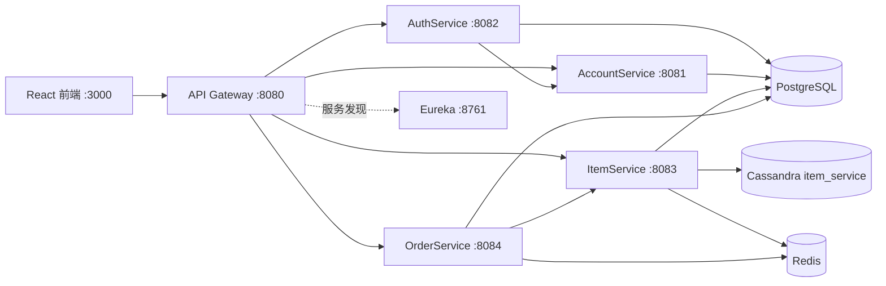

# Shopping Web MVP

这是一个可通过 Docker Compose 本地运行的电商微服务面试项目。当前 MVP 刻意只保留账户、认证、商品、库存和订单主链路：用户注册或登录后，卖家进入商品管理页，买家进入购物页并创建订单。项目重点展示服务发现、网关鉴权、多存储选型、缓存和并发库存控制，而不是假装已经具备完整生产电商系统的全部能力。

## 当前状态

截至 2026-09-04，六个后端模块、前端和三种数据基础设施可以一起构建和启动。已经实际验证以下链路：卖家注册并创建商品，买家登录并创建订单，订单从 PostgreSQL 写入后可连续从 Redis 缓存读取，库存通过 PostgreSQL 条件更新安全扣减。

项目统一使用 Java 17、Maven 3.9.11 Wrapper、Spring Boot 3.5.7 和 Spring Cloud 2025.0.1。根 POM 只聚合当前 MVP 所需的六个模块，旧的 Cart、Payment、Notification 和 Common 代码仍保留在仓库中，但不参与本次构建或 Compose 启动。

## 架构与数据归属



数据拆分遵循“按访问与一致性需求选择存储”的原则。AuthService 在 PostgreSQL 保存登录凭据，AccountService 在独立 schema 保存用户资料，OrderService 在独立 schema 保存订单和不可变的商品快照。ItemService 将适合按 ID 高吞吐读取的商品目录保存到 Cassandra，但将会发生并发竞争的库存保存到 PostgreSQL；Redis 只缓存商品和订单响应，不作为事实来源。

把目录放入 Cassandra 并不是所有公司的固定做法。许多公司的商品主数据也会放在 PostgreSQL/MySQL，再通过搜索引擎、缓存和只读模型扩展读取能力。本项目使用 Cassandra 的价值是展示多存储设计；把库存单独放进 PostgreSQL，则避免用弱事务模型直接处理超卖问题。面试时应明确解释这个取舍，而不要声称 Cassandra 天然比关系数据库更适合所有商品数据。

## 微服务职责

| 服务 | 职责 | 主存储 | 缓存/依赖 |
| --- | --- | --- | --- |
| API Gateway | 统一入口、CORS、JWT 校验、按服务名转发 | 无 | Eureka |
| EurekaServer | 服务注册与发现 | 无 | 无 |
| AuthService | 注册、登录、BCrypt 密码散列、签发 JWT | PostgreSQL `auth_service` | AccountService、Eureka |
| AccountService | 保存不含密码的用户资料与卖家身份 | PostgreSQL `account_service` | Eureka |
| ItemService | 商品目录 CRUD 与库存预留/释放 | Cassandra `shopping_catalog`、PostgreSQL `inventory_service` | Redis、Eureka |
| OrderService | 创建订单、保存价格快照、查询用户订单 | PostgreSQL `order_service` | ItemService、Redis、Eureka |
| frontend | 登录/注册、按角色分流、卖家商品管理、买家购物 | 浏览器状态 | API Gateway |

### 请求链路

注册时，AuthService 先创建认证凭据，并同步调用 AccountService 创建公开资料；返回值包含 JWT、用户 ID 和 `isSeller`。前端根据 `isSeller` 将卖家送到管理视图，将普通用户送到购物视图。

下单时，OrderService 不信任浏览器提交的价格，而是向 ItemService 读取商品名称、价格和币种。ItemService 用一条带 `available_quantity >= quantity` 条件的 PostgreSQL 更新语句预留库存，因此两个请求并发购买最后一件商品时，只有一个更新能够成功。OrderService 随后保存订单及商品快照，并把查询响应缓存到 Redis；如果保存阶段抛出异常，会尽力调用 ItemService 释放已经预留的库存。

## 数据模型

开发环境由 Hibernate 创建业务表，Compose 初始化脚本负责创建 PostgreSQL schemas 和 Cassandra keyspace。下表是当前实体对应的逻辑模型。

### PostgreSQL

`auth_service.users`

| 字段 | 类型/约束 | 用途 |
| --- | --- | --- |
| `id` | bigint, PK, identity | 认证用户 ID |
| `email` | varchar, NOT NULL, UNIQUE | 登录名 |
| `password` | varchar, NOT NULL | BCrypt hash，不保存明文 |
| `is_seller` | boolean, NOT NULL | 前端角色分流依据 |

`account_service.accounts`

| 字段 | 类型/约束 | 用途 |
| --- | --- | --- |
| `id` | bigint, PK, identity | 账户资料 ID |
| `email` | varchar, NOT NULL, UNIQUE | 与认证账户关联的邮箱 |
| `username` | varchar, NOT NULL | 展示名称 |
| `shipping_address` | varchar, nullable | 收货地址 |
| `billing_address` | varchar, nullable | 账单地址 |
| `seller` | boolean, NOT NULL | 是否卖家 |
| `created_at` | timestamp | 创建时间 |

`inventory_service.inventory`

| 字段 | 类型/约束 | 用途 |
| --- | --- | --- |
| `item_id` | varchar, PK | 对应 Cassandra 商品 UUID |
| `available_quantity` | integer, NOT NULL | 当前可售库存 |
| `version` | bigint, NOT NULL | 每次库存变化递增 |

`order_service.orders`

| 字段 | 类型/约束 | 用途 |
| --- | --- | --- |
| `id` | bigint, PK, identity | 订单 ID |
| `user_id` | bigint, NOT NULL | 下单用户 |
| `total_price` | numeric(19,2), NOT NULL | 服务端计算的总价 |
| `currency` | varchar(3), NOT NULL | 订单币种 |
| `status` | varchar, NOT NULL | 当前为 `PENDING` |
| `created_at` | timestamptz, NOT NULL | 创建时间 |

`order_service.order_items`

| 字段 | 类型/约束 | 用途 |
| --- | --- | --- |
| `id` | bigint, PK, identity | 明细 ID |
| `order_id` | bigint, FK | 所属订单 |
| `item_id` | varchar, NOT NULL | 商品 ID 快照 |
| `item_name` | varchar, NOT NULL | 商品名称快照 |
| `quantity` | integer, NOT NULL | 数量 |
| `price` | numeric(19,2), NOT NULL | 下单时单价快照 |

同一订单的 `(order_id, item_id)` 有唯一约束。价格和名称保存在订单明细中，保证卖家后来修改商品时，历史订单仍能显示下单时信息。

### Cassandra

`item_service.items_by_id`

| 字段 | 类型 | 用途 |
| --- | --- | --- |
| `id` | text, partition key | 商品 UUID |
| `name` | text | 名称 |
| `description` | text | 描述 |
| `price` | decimal | 展示价格 |
| `currency` | text | ISO 风格三字母币种 |
| `created_at` | timestamp | 创建时间 |
| `updated_at` | timestamp | 更新时间 |

当前查询模型只有“按 ID 查询”和“小数据量列出全部商品”。后者在 Cassandra 大数据量下不合适，未来应新增按分类或分页访问模式设计的反规范化表，而不是依赖全表读取。

## HTTP API

所有客户端请求都通过 `http://localhost:8080` 进入网关。除 `/api/auth/**` 外，其余路由需要 `Authorization: Bearer <token>`。

| 方法 | 路径 | 用途 |
| --- | --- | --- |
| POST | `/api/auth/register` | 注册并返回 token、userId、isSeller |
| POST | `/api/auth/login` | 登录并返回 token、userId、isSeller |
| POST | `/api/accounts` | 创建账户资料，通常由 AuthService 调用 |
| GET | `/api/accounts/{id}` | 查询账户资料 |
| GET | `/api/accounts` | 查询全部账户 |
| POST | `/api/items` | 创建商品及初始库存 |
| GET | `/api/items/{id}` | 查询商品与当前库存 |
| GET | `/api/items` | 查询商品列表 |
| PUT | `/api/items/{id}` | 更新商品及库存 |
| DELETE | `/api/items/{id}` | 删除商品及库存 |
| POST | `/api/items/{id}/decrease-stock` | 原子预留库存 |
| POST | `/api/items/{id}/increase-stock` | 释放库存 |
| POST | `/api/orders` | 创建订单 |
| GET | `/api/orders/{orderId}` | 查询订单，可命中 Redis |
| GET | `/api/orders/user/{userId}` | 查询用户订单 |

## 本地运行

前提是已安装并启动 Docker Desktop。项目不要求本机安装 Java、Maven、PostgreSQL、Redis 或 Cassandra；每个服务都由自己的多阶段 Dockerfile 构建，Maven Wrapper 保证使用仓库指定的 Maven 版本。

```bash
docker compose -f compose.yml up --build
```

首次构建需要下载 Maven、npm 和 Docker 镜像依赖，也需要等待 Cassandra 健康检查完成，因此会比之后启动慢。Compose 会按 PostgreSQL、Redis、Cassandra、Eureka、业务服务、网关和前端的就绪状态依次启动。

启动后可访问：

- 前端：<http://localhost:3000>
- API Gateway：<http://localhost:8080>
- Eureka 控制台：<http://localhost:8761>
- 网关健康检查：<http://localhost:8080/actuator/health>

如果本机 8080 已被其他项目占用，可以只改变网关的宿主机端口；前端构建时会自动使用同一个端口。

```bash
GATEWAY_PORT=18080 docker compose -f compose.yml up --build
```

查看状态和停止项目：

```bash
docker compose -f compose.yml ps
docker compose -f compose.yml down
```

`down` 不会删除命名数据卷。只有明确想清空本地 PostgreSQL、Redis 和 Cassandra 数据时才使用 `docker compose -f compose.yml down -v`。

## 不使用 Docker 的构建方式

macOS/Linux 使用：

```bash
./mvnw test
```

Windows 使用：

```powershell
mvnw.cmd test
```

Maven Wrapper 是随仓库提交的启动脚本和版本配置。它不是另一套构建系统；它会在第一次运行时取得项目指定的 Maven 3.9.11，然后仍然执行普通 Maven 生命周期。这样团队和 CI 不会因为各自安装的 Maven 版本不同而得到不一致结果。

项目以 Java 17 为目标版本；父 POM 已显式配置 Lombok annotation processor，因此在不再自动发现处理器的较新 JDK 上也能编译。正式开发和 CI 仍建议使用 Java 17，以保持与容器运行时完全一致。

前端位于 `frontend`，使用 Node.js 22 构建。单独开发时可执行：

```bash
cd frontend
npm ci
npm run dev
```

## 已验证内容

- Maven 六模块 reactor 测试通过。
- 前端 lint 和生产构建通过。
- 七个应用镜像均成功构建。
- PostgreSQL、Redis、Cassandra 与 Eureka 健康检查通过。
- 前端和网关健康接口返回 HTTP 200。
- 卖家注册、商品创建、买家登录、JWT 网关鉴权和订单创建通过。
- 同一商品列表和同一订单连续读取两次成功；已修复 Redis 的旧缓存隔离，以及订单对 `Instant` 和 `BigDecimal` 的序列化/反序列化问题。
- 下单后 PostgreSQL 库存按请求数量扣减；条件更新防止库存变成负数。

## TODO 与已知限制

这些项目是当前代码真实存在的边界，也是后续最适合按阶段推进的内容。

### 高优先级：身份与授权

- 网关目前只验证 JWT 是否有效，没有把经过验证的 userId 和角色作为可信身份传给下游。OrderService 仍接受请求体中的 `userId`，攻击者可以替其他用户下单或读取 `/api/orders/user/{userId}`。
- 前端的卖家/买家分流只是用户体验，不是服务端授权。ItemService 的创建、修改、删除接口必须增加 seller 权限检查，账户列表也不应向普通用户开放。
- 业务服务端口当前映射到宿主机，开发环境可以绕过网关直接访问。生产部署应只公开网关，并采用内部网络策略、服务间认证或 mTLS。
- 默认 JWT secret 只适合本地演示。部署时必须通过安全环境变量或 secret manager 提供独立高强度密钥，并增加 token 过期、刷新和撤销策略。

### 高优先级：跨服务一致性

- PostgreSQL 的原子条件更新解决了“多用户购买最后一件商品”的超卖问题，但库存预留和订单写入仍属于两个服务的两个本地事务。当前异常路径会同步补偿库存，却无法覆盖进程在两次调用之间崩溃、网络超时后结果未知、补偿调用失败等情况。
- 下一阶段应给库存预留增加 `reservationId` 和幂等约束，建立 `RESERVED / CONFIRMED / RELEASED / EXPIRED` 状态与过期释放机制。OrderService 可采用 transactional outbox 发布订单事件，再由 Saga 协调确认或释放库存。
- AuthService 创建凭据后再同步创建账户资料也存在相同的半成功窗口。可先用明确的补偿和幂等注册修复，再在需要时引入 outbox/Saga；不应为了面试展示而直接加入尚未正确使用的 Kafka。

### 商品与缓存

- 商品目录和 PostgreSQL 库存的创建、更新、删除不是跨数据库原子事务。需要用 outbox、可重试同步任务或 reconciliation job 检测并修复孤立记录。
- 商品列表当前调用 Cassandra `findAll()`，只适合 MVP。真实目录应根据分类、卖家、更新时间或搜索需求设计查询表，并使用 OpenSearch/Elasticsearch 承担文本搜索。
- Redis 采用 cache-aside，数据库是事实来源。仍需加入 TTL、缓存指标、热点 key 和击穿保护，并为缓存不可用设计降级；Redis 故障不应让核心写入返回失败。
- 库存接口使用 `Map<String,Integer>` 接收数量，后续应改成带 Bean Validation 的 DTO，并统一 400、404、409 错误响应格式。

### 订单能力

- 当前只有创建和查询，状态固定为 `PENDING`，尚无支付、取消、发货、退款和状态机。
- 用户订单查询没有分页；订单量增长后必须增加 `(user_id, created_at)` 索引并使用稳定游标或分页。
- 同一商品在一个订单请求中重复出现时会违反订单明细唯一约束；API 应在校验阶段合并重复商品或明确拒绝。
- 需要加入请求幂等键，防止客户端超时重试创建重复订单。

### 工程质量与运维

- 当前测试主要是上下文和少量单元测试；应增加 Testcontainers 集成测试以及覆盖注册、授权、库存竞争、补偿和缓存故障的端到端测试。
- Hibernate 使用自动建表适合本地 MVP，不适合生产。应使用 Flyway/Liquibase 管理 PostgreSQL migration，并用版本化 CQL migration 管理 Cassandra。
- 需要统一结构化日志、trace ID、Micrometer 指标、OpenTelemetry tracing、超时、重试和 circuit breaker。重试只能用于幂等操作，不能盲目重试下单。
- 前端依赖审计目前报告 13 个依赖链漏洞，其中 10 个为 high。升级前应检查脚手架及 Vinext 兼容性，不能直接使用破坏性自动修复。
- 旧的 CartService、PaymentService、NotificationService 和 Common 模块尚未迁移到当前架构。它们不在父 POM 和 Compose 中，后续应逐个评估、重写并测试，而不是直接重新启用。

## 推荐的下一步顺序

第一步应补齐服务端授权，让用户身份来自经过网关验证的 token，并限制卖家接口。第二步为下单加入幂等 key 和库存 reservation 模型，同时编写并发测试证明不会超卖。第三步再加入支付和取消状态机；只有事件契约、幂等、outbox 和失败恢复方案明确后，才引入 Kafka。这个顺序能让项目在每个阶段都可运行、可解释，也更符合面试中对工程判断的期待。
